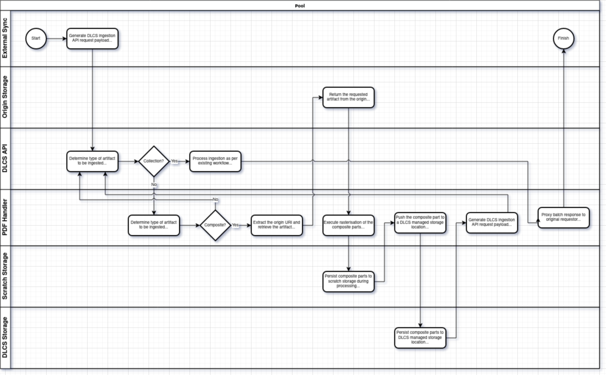

# Composite Handler Design

- Status: proposed
- Decisers:
  - Daniel Grant
  - Tom Crane
  - Donald Gray
  - Stephen Fraser
- Date: 2021-11-03

## Context and Problem Statement

### Context

A design for the implementation and delivery of a component of the DLCS
which can process "composite" artifacts. Such artifacts typically take
the form of a single object containing multiple embedded resources, each
of which can be rasterized and treated as an individual resource within
the DLCS.

## Considered Options

- Additional standalone component which consumes a DLCS ingest payload,
  retrieves the object, rasterizes accordingly, and then invokes the
  existing DLCS ingestion workflow.
- Deployment of an image server (e.g. Cantaloupe) which provides the
  same functionality to sit behind Orchestrator and process requests for
  component parts of a "composite" artifact on-the-fly.

## Decision Outcome

Delivery of a standalone component which consumes a DLCS ingest payload
tailored to "composite" artifacts, and triggers an ingestion workflow
which rasterizes each of the constituent parts and invokes the existing
DLCS ingestion workflow.

## Pros and Cons of the Options

### Standalone Component

#### Positive Consequences

- Self-contained enhancement, potentially requires no modification of
  existing components or, at worst, minimal configuration of the API
  component.
- Can be extended to support any arbitrary "composite" type (assuming
  tooling is available in the language).

#### Negative Consequences

- Requires development effort up front and ongoing.

### Image Server

#### Positive Consequences

- Pre-existing / out-of-the-box solution, minimal (if any) development
  effort requirement.
- Artifact processing / rasterization code already highly optimised.

#### Negative Consequences

- Requires modification of multiple existing components, i.e.
  Orchestrator, thumbnail generation, etc.
- Potentially a heavyweight solution, Cantaloupe image server can be
  resource intensive.
- Results in two image servers deployed within the DLCS - IIPImage and
  Cantaloupe - with significant effort to remove IIPImage entirely.
- Vendor lock-in, requiring significant effort to migrate away from a 
  specific image server implementation.

## Links

- [RFC: PDF's as Input](https://github.com/dlcs/protagonist/blob/master/docs/rfcs/011-pdfs-as-input.md)
