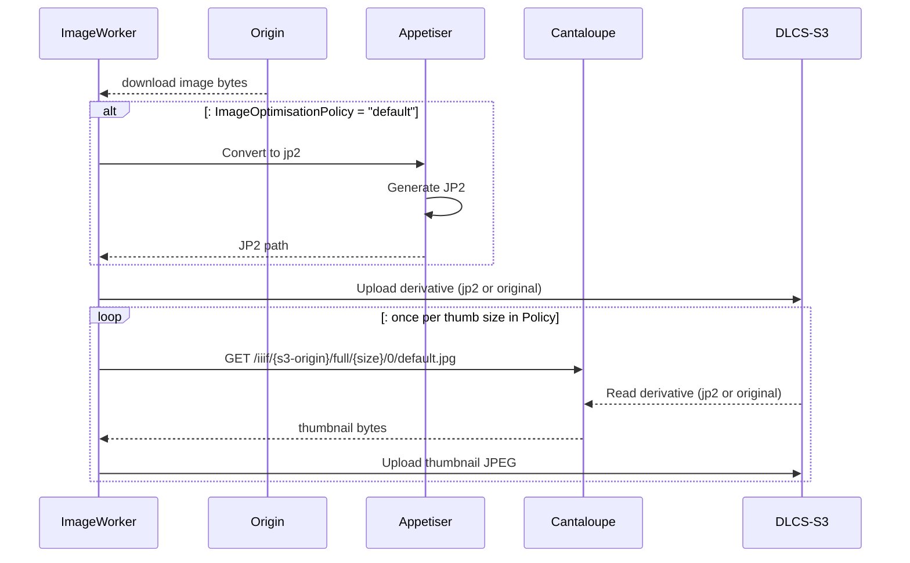
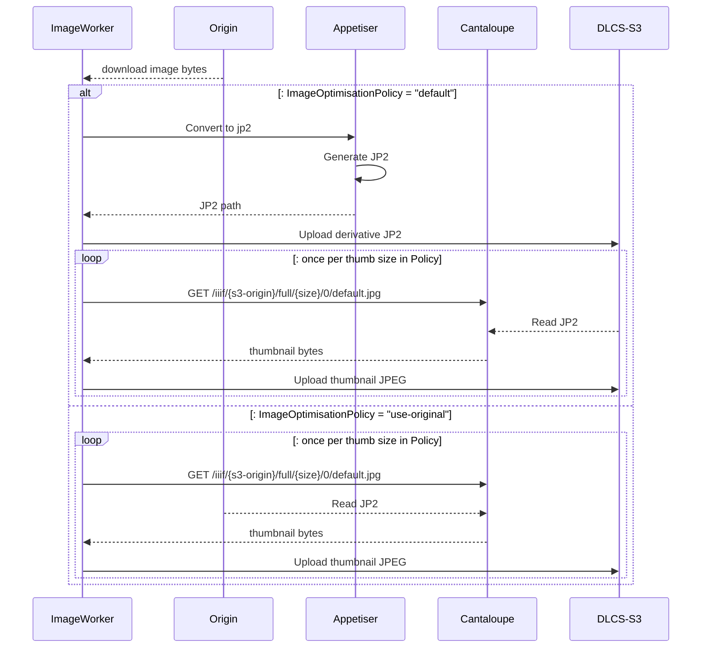
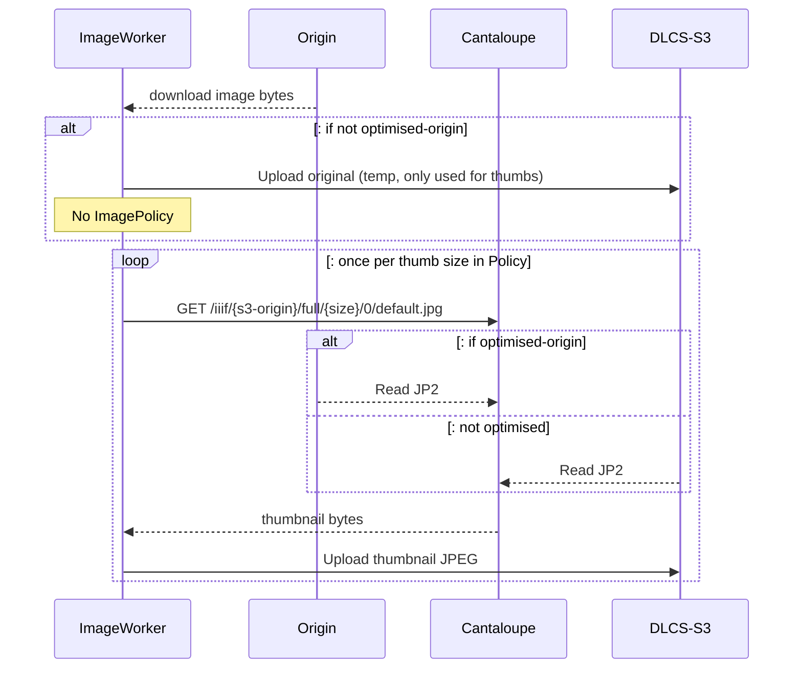

# Engine ImageServer for Thumbs

* Status: proposed
* Deciders: Donald Gray, Jack Lewis
* Date: 2024-01-29

Issues:
* [#256](https://github.com/dlcs/protagonist/issues/256)
* [#658](https://github.com/dlcs/protagonist/issues/658)

## Context and Problem Statement

DLCS Engine currently uses an array of single values to generated confined thumbnails. The thumbnail generation is done by [Appetiser](https://github.com/dlcs/appetiser) at the same time as JPEG2000 generation.

To allow Engine to produce thumbnails based on valid [IIIF ImageAPI Size Parameters](https://iiif.io/api/image/3.0/#42-size) we need to introduce an ImageServer for this, to avoid replicating that resizing logic elsewhere.

We need to identify the best way to have an available ImageServer for Engine use, without affecting live asset-request traffic.

## Decision Drivers

* Deployment - The deployment should remain straightforward.
* Simplicity - Refactoring Engine to use an image-server for thumbnail creation shouldn't make the code considerably more complex.
* Scaling - During times of high usage the Engine scales up to many instances. ImageServer should cope with additional use.

## Considered Options

* Run Cantaloupe as a sidecar of Fargate Engine task, sharing ephemeral storage.
* Run Cantaloupe as separate service shared by Engine instance on EC2 host. Sharing local disk.
* Run Cantaloupe as separate Fargate service, sharing EFS storage.
* Run Cantaloupe as separate Fargate service, sharing S3 object storage.
* All above but with dockerized [iiif-processor npm package](https://www.npmjs.com/package/iiif-processor) rather than Cantaloupe.

## Decision Outcome

Chosen option is: _"Run Cantaloupe as separate Fargate service, sharing S3 object storage."_

This is similar to how SpecialServer runs. We could use SpecialServer but don't want to put additional load on public image-serving traffic.

Cantaloupe streaming from S3 is not as performant as reading from disk but this shouldn't be an issue as it's at ingest time so no user waiting for bytes to load.

Origin will be accessible to image-server. It will either be an optimised S3 origin, or copied to DLCS storage. The exception is `thumbs` channel only without `iiif-img`. This would require a temporary S3 upload.

> See bottom of document for [working notes/sequence diagrams](#working-notes) used to work through problem.

### Positive Consequences

* Engine infrastructure remains unchanged.
* Cantaloupe is already used to serve images - consistent processing across ingest + delivery. Will use same docker image with different configuration.
* Can scale separate instance independant of Engine (e.g. 1 Cantaloupe per X Engines OR each Cantaloupe handles 500 req/s etc).
* No scavenging issues - shared storage is effectively limitless.

### Negative Consequences

* Additional service to manage.
* If requesting only `thumbs` channel, without `iiif-img`, we require a temporary file in S3 for thumbs generation (for cleanup we can use an [S3 lifecycle rule](https://docs.aws.amazon.com/AmazonS3/latest/userguide/object-lifecycle-mgmt.html)).
* Distributed calls to generate thumbs - may need automatic retry or backoff to avoid failing ingest if single request fails.

## Pros and Cons of the Options

### Run Cantaloupe as a sidecar of Fargate Engine task, sharing ephemeral storage

#### Positive Consequences

* Simplest arrangement, http calls are made to locally addressed Cantaloupe. Scaling is 1:1.
* Consistent approach with how Appetiser is currently used.
* Reading from local disk more performant than reading from S3.

#### Negative Consequences

* Basic Engine task would need to have more resources (more $$$), even if lightly used.

### Run Cantaloupe as separate service shared by Engine instance on EC2 host. Sharing local disk.

#### Positive Consequences

* Multiple engines can use single Cantaloupe.

#### Negative Consequences

* Management overhead, need to manage EC2 instances (patching etc).
* Bigger starting stakes - majority of time resources on EC2 will be unused.
* Scaling could get complicated.

### Run Cantaloupe as separate Fargate service, sharing EFS storage.

#### Positive Consequences

* Multiple engines can use single Cantaloupe.
* No need to manage infrastructure if using Fargate.

#### Negative Consequences

* Unsure how EFS would operate under load. Would need thorough testing.

### All above but with dockerized [iiif-processor npm package](https://www.npmjs.com/package/iiif-processor) rather than Cantaloupe.

#### Positive Consequences

* Dockerized NPM package should be much more lightweight than Cantaloupe.

#### Negative Consequences

* Ingest and image-serving using different technology. Different processors could result in errors or subtly different output (e.g. rounding issues/colour casts).

## Working Notes

Below are some working notes that were made to work out whether we are able to cover all required ingest permutations:

| d-c             | ImageOptPolicy | Origin Type  | Origin Format | What happens in Engine                                                                                                                              |
| --------------- | -------------- | ------------ | ------------- | --------------------------------------------------------------------------------------------------------------------------------------------------- |
| iiif-img,thumbs | default        | http*        | *             | Download origin. Calls Appetiser to convert. Uploads converted to S3. Calls Cantaloupe to generate thumbs. Uploads thumbs to S3.                    |
| iiif-img,thumbs | default        | http*        | image/jp2     | Download origin. Calls Appetiser to convert (would be a no-op). Uploads converted to S3. Calls Cantaloupe to generate thumbs. Uploads thumbs to S3. |
| iiif-img,thumbs | default        | s3-optimised | *             | Download origin. Calls Appetiser to convert. Uploads converted to S3. Calls Cantaloupe to generate thumbs. Uploads thumbs to S3.                    |
| iiif-img,thumbs | default        | s3-optimised | image/jp2     | Download origin. Uploads converted to S3. Calls Cantaloupe to generate thumbs. Uploads thumbs to S3. |
| iiif-img,thumbs | use-original   | http*        | *             | Download origin. Upload origin to S3. Calls Cantaloupe to generate thumbs. Uploads thumbs to S3.                                                    |
| iiif-img,thumbs | use-original   | s3-optimised | *             | Download origin. Call cantaloupe to generate thumbs (from original). Upload thumbs to S3.                                                           |
| thumbs          | N/A            | http*        | *             | Download origin + upload to origin to S3 (_where?_). Call cantaloupe to generate thumbs. Upload thumbs to S3.                                       |
| thumbs          | N/A            | s3-optimised | *             | Call cantaloupe to generate thumbs from s3 origin. Upload thumbs to S3.                                                                             |
| file,thumbs     | N/A            | http*        | *             | Origin already at s3://dlcs-storage. Call cantaloupe to generate thumbs. Upload thumbs to S3.                                                       |
| file,thumbs     | N/A            | s3-optimised | *             | Call cantaloupe to generate thumbs from s3 origin. Upload thumbs to S3.                                                                             |

> http* == not s3-ambient

> `thumbs` without `iiif-img` would need thumbs uploaded to an s3 DLCS-storage location but it only needs to be transient. Can store with a known prefix and use S3 lifecycle removes to cleanup.

------------------

### Non Optimised Origin (iiif-img,thumbs)

### Optimised Origin (iiif-img,thumbs)

### NonOptimised Origin (thumbs only)

