# In-house Native Image Server

- Status: proposed
- Deciders: Tom Crane, Donald Gray
- Date: 2024-10-08

Issues:

## Context and Problem Statement

DLCS currently uses Cantaloupe to serve IIIF Image API requests. The performance and reliability of Cantaloupe has been unsatisfactory despite attempts to improve the situation by replacing OpenJPEG with Kakadu across our deployments and optimizing JVM settings.

The bottlenecks in Cantaloupe are primarily I/O and memory bandwidth. Stalls can be put into 2 distinct categories:

- IO stalls
- Memory stalls

I/O stalls occur when codestream data required for decoding is unavailable. Cantaloupe performs synchronous read requests to S3, blocking decoding until the request completes.
In the diagram below, **red** denotes a blocking IO operation that stalls the decoder.

```mermaid
---
displayMode: compact
---
gantt
    title Cantaloupe Image Pipeline
    dateFormat x
    axisFormat %L ms
    tickInterval 100millisecond

    section Browser
      Send IIIF Image API request :send_iiif_image_req, 1, 1ms
      Read JPEG :crit, browser_read_image_1, after encode_jpeg_tile_1, 5ms
      Read JPEG :crit, browser_read_image_2, after encode_jpeg_tile_2, 5ms

    section Server
      Handle IIIF image API request :iiif_image_req, after send_iiif_image_req, 2ms
      Write JPEG :crit, write_jpeg, after encode_jpeg_tile_1, 5ms
      Write JPEG :crit, write_jpeg_2, after encode_jpeg_tile_2, 5ms

    section I/O thread
      Read JPEG2000 header :crit, header_request, after iiif_image_req, 10ms
      Read codestream :crit, codestream_request, after decode_header, 10ms
      Read codestream :crit, codestream_request_2, after browser_read_image_1, 10ms

    section Kakadu
      Decode metadata :decode_header, after header_request, 2ms
      Decode tile part :kdu_decode_tile_1, after codestream_request, 10ms
      Decoder blocked :milestone, m1, after kdu_decode_tile_1, 2ms
      Decode tile part :kdu_decode_tile_2, after codestream_request_2, 10ms

    section TurboJPEG
      Encode tile part :encode_jpeg_tile_1, after kdu_decode_tile_1, 5ms
      Encode tile part :encode_jpeg_tile_2, after kdu_decode_tile_2, 5ms
```

Memory stalls are the result of the JVM being unable to serve a memory allocation request without performing clean-up (i.e. a garbage collection event).
Since Cantaloupe has no way to constrain the memory used by native processors this leads to a tricky situation where Kakadu can cause an OOM while the JVM tries to reclaim memory by invoking the garbage collector.

These stalls are the result of a less than optimal approach to handling codestream data and IO. However, they're also exacerbated by fundamental architecture decisions Cantaloupe is restricted by (e.g. being built on the JVM).

## Decision Drivers

TODO

## Considered Options

TODO

## Decision Outcome

TODO

### Positive Consequences

TODO

### Negative Consequences

TODO

## Pros and Cons of the Options

TODO
