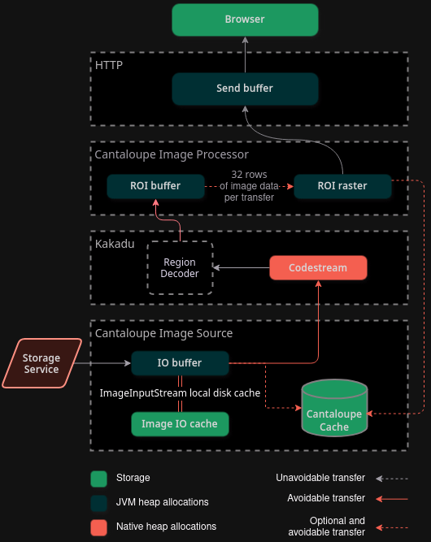

# In-house Native Image Server

- Status: proposed
- Deciders: Tom Crane, Donald Gray
- Date: 2024-10-08

Issues:

## Context and Problem Statement

DLCS serves IIIF Image API requests through Cantaloupe. Despite optimization efforts - including migrating from OpenJPEG to Kakadu and tuning JVM parameters - the system experiences frequent out-of-memory crashes and processing stalls under production loads. A thorough technical review of the Cantaloupe image processing pipeline ahs identified two key bottlenecks:

- I/O stalls during image data access
- Runtime stalls due to poor memory management

The sections below drill into these bottlenecks, their impact on system reliability, and the ideal approach to solving them.

### I/O stalls

Source image data must be fetched before decoder work can proceed. Cantaloupe's synchronous I/O design means each read operation blocks the decoder, as shown by the red segments in the diagram below.

These idle periods occupy system resources while waiting for I/O, with allocated memory buffers remaining unused. This inefficient resource utilization directly impacts server capacity, placing an upper bound on the maximum number of concurrent image requests that can be processed.

An asynchronous processing model, in contrast, allows work to progress continuously. The diagram below demonstrates this approach as implemented in the Laya image server pipeline.

Laya implements two key architectural optimizations that help it maintain high throughput with minimal resource overhead:

- Incremental decoding that processes input data as it arrives, eliminating input stalls
- Double-buffered output that streams partially decoded images to clients while processing continues, eliminating output stalls

Processing resources remain active only when performing useful work, allowing more concurrent image requests with fewer system resources.

### Runtime stalls

Runtime stalls occur when the JVM pauses image processing to reclaim memory through garbage collection. Memory usage is difficult to predict based on request volume since allocations occur across multiple stages of the pipeline in varying sizes - both in JVM heap space and native memory. The major risk comes from the native buffer allocations: they are unbounded and cannot be reclaimed by the JVM. If the JVM needs to allocate memory while these native buffers are consuming heap space, garbage collection may fail to free enough memory, causing the server to crash with an out-of-memory error.

The diagram below traces memory transfers during the processing of an image request. Grey arrows indicate essential data movement through the pipeline, while red arrows show potentially avoidable copies created by JVM and inter-system boundaries.

While some of these copies are avoidable in theory solving them comes with significant technical challenges. Notably, the architecture of Cantaloupe is designed around serving complete images rather than streaming responses to the client. Without solving this we will always need allocations large enough to hold entire regions of interest in memory.

## Decision Drivers

- System stability and predictable behavior under load
- Observability and monitoring
- Development and maintenance cost

## Considered Options

- Digirati develops a new high-performance native image server
- Contribute small improvements back to Cantaloupe over time
- Propose changes to the Cantaloupe image processing pipeline to accomodate a fast-path for native processors

## Decision Outcome

TODO

### Positive Consequences

TODO

### Negative Consequences

TODO

## Pros and Cons of the Options

### Digirati develops a new high-performance native image server

#### Positive Consequences

- Availability of in-house resources for low-level optimization
- Potential to reduce operational costs significantly and operate image servers on low-cost platforms (Arm64, AWS Lambda)
- Significantly improved OpenTelemetry based monitoring with support for AWS X-Ray
- Has been in progress as an open-source project for months, with a significant amount of work completed: https://github.com/digirati-co-uk/laya
- Can meet the needs of users serving >100GB compressed images (i.e. scientific imaging community and OpenSlide, et al.)
- Using native APIs directly permits optimizations that aren't directly available in languages that aren't compiled AOT (LTO, PGO, architecture specific optimizations)

#### Negative Consequences

- Difficult to find Rust/C++ developers
- Large upfront cost in testing/benchmarking/migrating
