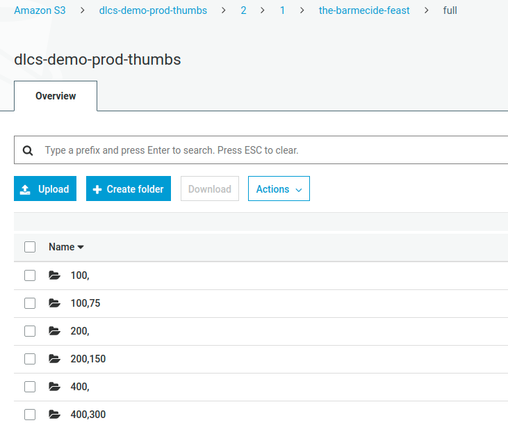
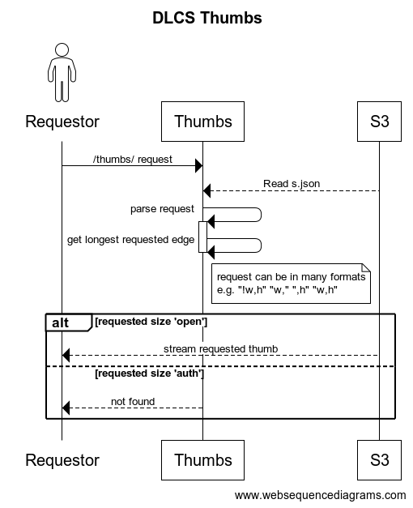

# Rethinking thumbnail handling

Previously, the DLCS stored thumbnails in S3 in a way that matched Image Service URLs. This meant you could just proxy S3 and serve thumbnails quickly.

If an image is registered with a named thumbnail policy, or the default thumbnail policy, images will be laid out in S3 to match the paths supported by a _level 0_ Image API service.

A thumbnail policy defines a set of square containments, for example:

`[1024, 400, 200, 100]`

The DLCS also stores the largest thumb (e.g., 1024 pixels on longest edge) as `low.jpg` - this is the image used to generate PDFs.


There are some problems with this.

We're already storing two copies, to support the canonical (in IIIF 2.1) `/w,/` size parameter, and the `/w,h/` size:



And, we generate a lot of S3 keys:

```
2/1/the-barmecide-feast/full/100,/0/default.jpg
2/1/the-barmecide-feast/full/100,75/0/default.jpg
2/1/the-barmecide-feast/full/200,/0/default.jpg
2/1/the-barmecide-feast/full/200,150/0/default.jpg
2/1/the-barmecide-feast/full/400,/0/default.jpg
2/1/the-barmecide-feast/full/400,300/0/default.jpg
2/1/the-barmecide-feast/low.jpg
```

And, we're not entirely "static" anyway. We also support the `/!w,h/` syntax which is essential for building UIs when you know the identifier of an image service, and you know the Thumbnail Policy your images are using, but you don't know the actual size of the images. That is, you know you can safely ask for `/!200,200/` to get a thumbnail that fits with your UI, but you don't know the aspect ratio of the image. This is typical in search results. The image returned by that request might be 200 x 150, or 150 x 200 - you don't know enough to request it using either the `/w,/` or `/w,h/` syntax.

We also dynamically (from a template) generate the info.json. So we're doing some lightweight processing in front of it anyway, to support various use cases. 

## Access control considerations

Tizer/Appetiser makes all the thumbnails specified by the ThumbnailPolicy. Sometimes, if access restrictions are in place, some or all of these should not be available to the unauthed user.

We want to keep the thumbnail service simple and avoid it having to look things up. We don't want to introduce auth services on thumbnails. But we can't simply not make the larger sizes - for example, PDFs can still be generated from the 1024 image even if it doesn't appear in a thumbnail service.

That being the case, we can store thumbnails in S3 like this:

```
/thumbs-bucket/2/1/image-id
    /open
        100.jpg
        200.jpg
    /authed
        400.jpg
        1024.jpg
    s.json
```

Where `s.json` contains the different thumbnail sizes and looks like this (for example):

```
{
    "o": [
        [200,127],
        [100,64]
    ],
    "a": [
        [1024,651],
        [400,254]
    ]
}
```

All the thumbs might be in "o" for "open", or all in "a" for "auth", or a mixture as above.

While other services like PDF generation might use thumbnails from either `/open` or `/auth`, the thumbnail service can only use the thumbs in `/open`, it's not able to proxy anything that isn't in there.

Given this information, and the cached thumbnail policy, we can handle these requests by determining the larger of width and height (let this be nnn) and serving /open/nnn.jpg:

```
.../image-id/full/200,127/0/default.jpg
.../image-id/full/150,200/0/default.jpg
.../image-id/full/!200,200/0/default.jpg
```

This means the handler for `/thumbs/` has no need to consult any data source, it just examines the request URL, picks the matching nnn.jpg, and proxies it. 

Most thumbnail requests are either `/w,h/` (because you have that information in a manifest, to generate all the thumbs for one item) or `\!n,n` (because you know the image id, and the policy, but not the aspect ratio).

And we can handle these requests that are not of this form by consulting the `s.json` information first, and finding a matching width or height from the list under the "o" key:

```
.../image-id/full/200,/0/default.jpg
.../image-id/full/,200/0/default.jpg
.../image-id/full/150,/0/default.jpg
.../image-id/full/,150/0/default.jpg
```



If we only have one dimension we don't know enough, even if it matches one of our known thumbnail policy sizes, but the cost of acquiring the additional information is either:

* Read the `s.json` from S3 (which can be cached for a short duration).

or

* Get the image record from the database, and hence its actual size and thumbnail policy, and determine what the thumb sizes would be.

A completely S3-backed (or alternative object storage like Azure Blob) service is appealing.

This only works if the DLCS confines thumbnails to squares - which it does, and nobody has ever asked for anything different.

This approach is more flexible, uses far fewer S3 keys, is very very scalable, and is simpler. It still appears to be a normal level 0 IIIF Image API Service, it works with OpenSeaDragon, Mirador 3 etc.

It does mean migrating old layout to new layout for existing DLCS implementations. See [Thumb Rearranger](#thumb-rearranger), below for more details.

## [Engine](006-Engine-Image.md)

The current Deliverator/Engine is producing both the 'old' (Level 0-esque layour) and 'new' (open/auth) thumb layout.

The former is to the layout expected by the current orchestrator, the latter is to address above problem.
 

 ## Thumb Rearranger

The `thumbs` application has a configuration property "EnsureNewThumbnailLayout". This is used for existing DLCS instances that have some thumbnails created using the initial layout, as detailed above. When enabled the `thumbs` application will verify that the 'new' layout exists, by checking for existance of `s.json`. 

If it is _not_ found then it will call out to the database to get enough information to workout which thumbs are open and which are auth'd. This takes MaxUnauthorised and Roles into account.

It will then rearrange the existing thumbnails, maintaining the old format for backwards compatibility with additional systems. By doing this 'on the fly' rearranging of thumbs we can verify that we are getting the speed benefits addressed above without needing to do a bulk operation to rearrange.
