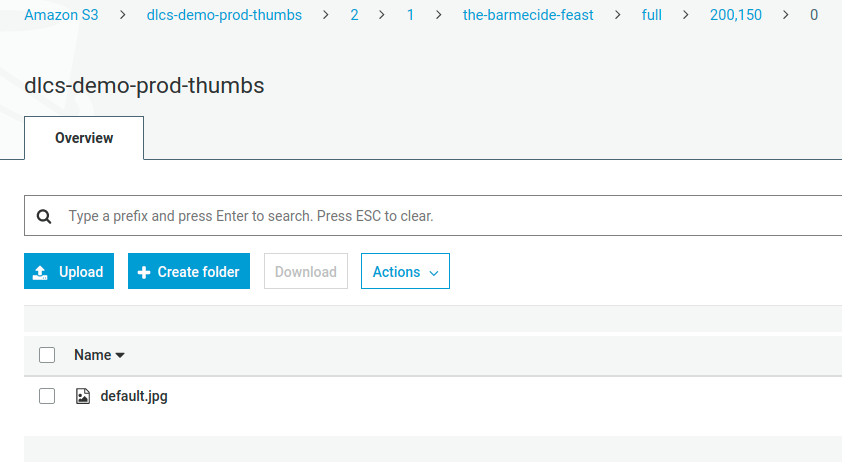

# Rethinking thumbnail handling

At present, the DLCS stores thumbnails in S3 in a way that matches Image Service URLs. This means you can just proxy S3 and serve thumbnails quickly.

If an image is registered with a named thumbnail policy, or the default thumbnail policy, images will be laid out in S3 to match the paths supported by a _level 0_ Image API service.

A thumbnail policy defines a set of square containments, for example:

`[1024, 400, 200, 100]`

The DLCS also stores the largest thumb (e.g., 1024 pixels on longest edge) as `low.jpg` - this is the image used to generate PDFs.


There are some problems with this.

We're already storing two copies, to support the canonical (in IIIF 2.1) `/w,/` size parameter, and the `/w,h/` size:


And, we generate a lot of S3 keys:



And, we're not entirely "static" anyway. We also support the `/!w,h/` syntax which is essential for building UIs when you know the identifier of an image service, and you know the Thumbnail Policy your images are using, but you don't know the actual size of the images. That is, you know you can safely ask for `/!200,200/` to get a thumbnail that fits with your UI, but you don't know the aspect ratio of the image. This is typical in search results. The image returned by that request might be 200 x 150, or 150 x 200 - you don't know enough to request it using either the `/w,/` or `/w,h/` syntax.

We also dynamically (from a template) generate the info.json. So we're doing some lightweight processing in front of it anyway, to support various use cases. 

## Access control considerations

Tizer/Appetiser makes all the thumbnails specified by the ThumbnailPolicy. Sometimes, if access restrictions are in place, some or all of these should not be available to the unauthed user.

We want to keep the thumbnail service simple and avoid it having to look things up. We don't want to introduce auth services on thumbnails. But we can't simply not make the larger sizes - for example, PDFs can still be generated from the 1024 image even if it doesn't appear in a thumbnail service.

That being the case, we can store thumbnails in S3 like this:

```
/thumbs-bucket/2/1/image-id
    /open
        100.jpg
        200.jpg
    /authed
        400.jpg
        1024.jpg
    sizes.json
```

Where `sizes.json` looks like this (for example):

```
{
    "o": [
        [200,127],
        [100,64]
    ],
    "a": [
        [1024,651],
        [400,254]
    ]
}
```

All the thumbs might be in "o" for "open", or all in "a" for "authed", or a mixture as above.

While other services like PDF generation might use thumbnails from either `/open` or `/authed`, the thumbnail service can only use the thumbs in `/open`, it's not able to proxy anything that isn't in there.

Given this information, and the cached thumbnail policy, we can handle these requests by determining the larger of width and height (let this be nnn) and serving /open/nnn.jpg:

```
.../image-id/full/200,127/0/default.jpg
.../image-id/full/150,200/0/default.jpg
.../image-id/full/!200,200/0/default.jpg
```
This means the handler for /thumbs/ has no need to consult any data source, it just examines the request URL, picks the matching nnn.jpg, and proxies it. 

Most thumbnail requests are either `/w,h/` (because you have that information in a manifest, to generate all the thumbs for one item) or `\!n,n` (because you know the image id, and the policy, but not the aspect ratio).

And we can handle these requests that are not of this form by consulting the sizes.json information first, and finding a matching width or height from the list under the "o" key:

```
.../image-id/full/200,/0/default.jpg
.../image-id/full/,200/0/default.jpg
.../image-id/full/150,/0/default.jpg
.../image-id/full/,150/0/default.jpg
```

If we only have one dimension we don't know enough, even if it matches one of our known thumbnail policy sizes, but the cost of acquiring the additional information is either:

* Read the sizes.json from S3

or

* Get the image record from the database, and hence its actual size and thumbnail policy, and determine what the thumb sizes would be

A completely S3-backed service is appealing.

This only works if the DLCS confines thumbnails to squares - which it does, and nobody has ever asked for anything different.

This approach is more flexible, uses far fewer S3 keys, is very very scalable, and is simpler. It still appears to be a normal level 0 IIIF Image APi Service, it works with Openseadragon, etc.

It does mean migrating old layout to new layout.

> There is a PR that provides a thumbnail service implementing this logic, and also migrates old layout to new layout on demand, which can be deployed to a parallel /testthumbs/ or similar, for playing with.


## Engine changes

The current Deliverator/engine is already producing an earlier version of this layout.
It must also keep on producing the layout expected by the current orchestrator.

/DLCS.Application/Behaviour/Thumbnails/ProcessWebTizerOutputBehaviour.cs

It needs to be updated to:

 - produce the new layout described above, split into open/authed
 - produce the new sizes.json
 - delete any keys that don't match these (apart from keys for the original layout) - that is, don't leave keys in `/open` because they will be served regardless of the sizes.json for `w,h` or `!w,h` requests, which don't need to look it up.
 - It will need to call https://github.com/digirati-co-uk/deliverator/blob/0f6604afdd5e82a03fad1ba6707026483925765d/DLCS.Data/Extensions/ImageEx.cs#L12 (this tweaked version not yet in master) and compare it to the array of thumb sizes it got from Tizer.
 

 ## Thumb rearranger

 The code in the new Thumbs service will also need to obtain the _permitted_ sizes, that take MaxUnauthorised into account, which will require something like that extension method mentioned above in our new repo (in a shared lib) (we've already got `GetThumbnailPolicy()`).


