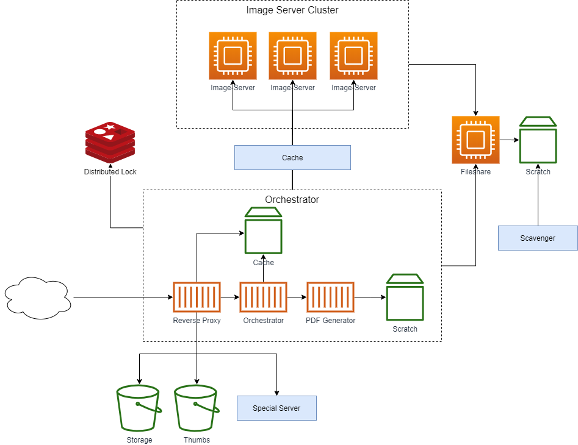

# Storage and Orchestration

## Context

From [What is the DLCS?](../what-is-dlcs-io.md)

> We could just have a cluster of one or more Image Servers and lots of disk space accessible by those servers.

> The problem with that is scale. For example, Wellcome has a lot of images: 40 million and counting, dozens of terabytes of disk space. They are already storing them in S3, for digital preservation.

> Access to these images also follows a steep long-tail distribution. Many images won't get looked at for months or even years, whereas some are looked at all the time.

> We want the best of both worlds - we want the low cost of S3 storage for terabytes of images, especially as many of them are rarely used. But we _need_ the performance and crucially the random access filesystem behaviour of EBS and similar volumes.

> The DLCS is an attempt to have this cake and eat it.

> The DLCS uses IIPImage under the hood (although it could use other image servers). But it fronts it with an _Orchestrator_ that copies files from S3 _origins_ to a local volume for use by IIPImage. As far as IIPImage is concerned, whenever it gets a request to extract a region from an image, that image is where it expects it to be on a locally readable disk. But it's only there because the orchestrator ensured it was there before the request arrived at IIPImage.

> At any one time, only a very small subset of the possible images that the DLCS knows about (that have been registred) are on expensive fast disks. This _cache_ is what the DLCS maintains - ensuring images are present when IIPimage needs them, and scavenging disk space to keep this working set at a sensible size.

<!-- 
Re the orchestrator sequence diagram, and all the different reverse proxy features that go in in there...
 - in memory response caching (possibly)
 - disk-backed response caching
 - proxying to S3 based on business logic
 - consulting Redis (or similar) to make a decision
 - talking to PostgreSQL
 - initiating a long running process (copying a file - long running by web server standards)
 - access control logic
 - passing to a load balancer pool AFTER doing some of the above
 - simple proxying to further services after doing some of the above
-->

## Architecture

The above diagram has many components, these are discussed below but a short overview of them:

### Orchestrator

At a fundamental level the Orchestrator is a reverse proxy that contains a _lot_ more business logic than would normally be found in a reverse proxy. It makes decisions on incoming requests and decides where these should be routed. 

The _Orchestrator_ application is also responsible for fetching tile-optimised assets from their source (be that an Optimised Origin, or a DLCS specific location - see [Engine - Image](006-Engine-Image.md)) so that they are ready to be used by the ImageServers.

It is a collection of containerised services that act together to serve image-assets.

#### Reverse Proxy

This is a standard Reverse Proxy. It could sit in front of the Orchestrator application (but still inside the wider _Orchestrator_ box, as shown in the diagram) (for example [Lua script in NGINX](https://github.com/openresty/lua-nginx-module#readme)) and make back-channel requests 'into' the main Orchestrator application to aid in decision making.

Alternatively it could be inside the Orchestrator application (for example [YARP](https://microsoft.github.io/reverse-proxy/) for a dotnet application) and use in-process requests to aid in decision making. If this kind of reverse proxy is available and performant/feature rich enough then it is preferred as it keeps everything cleaner and in one single place.

The back channel/in-process requests that are made from the Reverse Proxy to the Orchestrator are:

* Is the request for an asset that requires auth?
* Is the request for a full image we have a thumbnail for?
* Is the request for a `/full/` image?
* Is the request for a tile that we have served recently (i.e. is tile in the cache)?
* What is the Id for this customer name? (e.g. if request is for `/iiif-img/friendly-name/1/the-barmecide-feast`, 'friendly-name' is replaced by the integer Id for downstream calls).

The answers to these questions may involve round trips to PostgreSQL database (to get `ThumbnailPolicy` or `MaxUnauthorised` value).

#### Cache

The cache inside the Orchestrator is a disk-based (e.g. [Varnish](https://varnish-cache.org/)) or in-process memory cache (or a combination of the two). This is a hot-cache of recently responses and sits infront of the Orchestrator.

The caching eviction algorithm used (e.g. LRU vs LFU) will depend on implementation and supported use cases. 

404s can be cached for short lengths of time (e.g. 30s) to avoid flooding downstream resources for repeated queries for non-existant, or still ingesting, assets.

200s are cached for longer but only open requests are cached.

In some instances a smarter algorithm may need to be used. For example, if we have a huge JPEG2000 file that is rarely accessed but is slow to orchestrate then we may let this sit 'stale' for longer than we would a single page of a book with a 800KB JPEG2000 file.

#### Orchestrator

The main business logic behind Orchestration. This can access a list of what images are on the Fileshare. The list of images on the FileShare is maintained in an external system, such as Redis.

If a request comes in for an image that is _not_ on the FileShare then it will copy the tile-optimised image from Storage to FileShare, ready to be used by the image-servers.

It can consult the Distributed Lock to decide what state an image is in and react accordingly:

* Not Orchestrated > orchestrate image and mark as Orchestrating.
* Orchestrating > hold up request until Orchestrated.
* Orchestrated > let request pass.

#### PDF Generator

This component takes a JSON playbook that documents what the contents of the PDF should be and where the resulting PDF should be stored (e.g. S3 bucket). [Fireball](https://github.com/fractos/fireball) is an implementation of a PDF generator.

See [Named Queries](004-Named-Queries.md) for more information on how PDF generation can work.

### Distributed Lock

This is an external resource that can provide distributed locking for multiple Orchestrator instances. It is used to avoid multiple Orchestration requests. For example, when someone opens an image in a IIIF Viewer and a flood of 40 tile requests come in simultaneously. In this instance we only want to Orchestrate (copy the image from source to Fileshare) once, rather than 40 times. The Distributed Lock helds to hold up 39 of the requests until the image is available for use by the image-servers.

Shown as [Redis](https://redis.io/topics/distlock) on the diagram but could be replaced by an alternative service that supports distributed locking.

> In a smaller scale DLCS implementation this logic could live within the _Orchestrator_ application boundary as all orchestration requests will go via one central application.

### Cache

The external cache sits between the Image Server Cluster and Orchestrator instances. Whether it is required depends on individual use cases but it can help:

* Speed on 'on boarding' of a new Orchestrator instance when scaling up.
* Cache tiles for assets that require authentication. The auth check will have been carried out at Orchestrator layer. The Orchestrator doesn't cache any authorised files, it passes the request to image-servers.

Can be disk-based or HTTP cache depending on requirements. Disk-based cache would better suit scenarios where lots of different assets are being requested and HTTP cache suit scenarios where lots of users are requesting the same assets.

### Fileshare

Fast, local network attached storage. This contains the source tile-optimised files that the image-servers will use to generate tiles from. Each image-server will have this drive mounted. 

The Fileshare is ignorant of how to fetch or clean files, the Orchestrator is responsible for fetching the files from storage and writing them onto the Fileshare before triggering requests to the image-server. Orchestrator is the only thing that will write to this location.

### Image Server Cluster

1:n IIIF Image-Servers ([Loris](https://github.com/loris-imageserver/loris), [Cantaloupe](https://cantaloupe-project.github.io/) or [IIPImage](https://github.com/ruven/iipsrv)). These fetch images from Fileshare to local disk and serve tile requests.

They sit behind a load balancer to share the load across the cluster. Load balancing algorithm can vary depending on load balancing technology used, from simple round-robin to a more complex algorithm using least-traffic or URL. For example to ensure that all requests for a particular image are served by the same server.

### Scavenger

Scavenger is a separate application that maintains the files in the Fileshare. It will periodically check the fileshare for old, redundant files and remove them. It will only scavenge files when a configurable threshold has been hit (e.g. when drive is 75% full) and can be configured to _not_ clean files that are younger than a specific threshold.

 This maintains multiple [SortedSets](https://redis.io/topics/data-types#sorted-sets) that score each file by last access and added time.

## Orchestration

### Images 

The DLCS uses local volumes for image-servers to read, and the request pipeline holds up an image request if orchestration is required. It uses Redis and separate scavenger processes to maintain knowledge of what's where, and to keep the disk usage of this _hot cache_ stable.

The most expensive part of an image request is when an asset needs copied from source to FileShare. This will be from close object storage (same region S3 bucket) but there will be some latency involve copying a file across the network, particularly in the case of a large file. There can be some optimisations in place, for example a request for IIIF `/info.json` can be used to trigger Orchestration, with the assumption that an image has been opened in a viewer and subsequent requests will be for image resources. This is not always the case but the frequency of only `/info.json` requests vs the cost of unnecessary orchestration is generally okay.

But this is still our extra plumbing, more complexity to manage. 

One ideal scenario is an imaginary AWS offering - S3-backed volumes where you can specify a source bucket, and the size of "real" volume you want (e.g., 1TB). The file system view can be read only - we don't need to write to the bucket via a filesystem, we can do that as S3. Reads of the filesystem manage the orchestration at that file access, below our application logic. We just assume that if it's in the bucket, it can be read from the file system, and everything looks simple.

### AV

Orchestration for AV files is somewhat simpler. The assets are larger, we do not cache them and there's no equivalent to requesting tiles. If an AV asset is 'open', the request is served from the underlying object storage. 

If an asset requires authentication then the Orchestrator is responsible for the auth logic, once authorised the underyling AV file is served in chunks.

## Alternatives to Orchestration where possible

There's a difference between image requests for the `/full/` region, and tile requests. Full region requests (that don't match a known thumbnail size) are likely to be the user looking at one image at a time, whereas tile requests arrive in a flood, for the same image, and are generated by deep zoom clients.

We're have the separate [`/thumbs/`](001-thumbnails.md) path for cases where the client knows what sizes to ask for.

We direct `/full/` requests down a different path, see [Special Server](010-special-server.md) for further details.