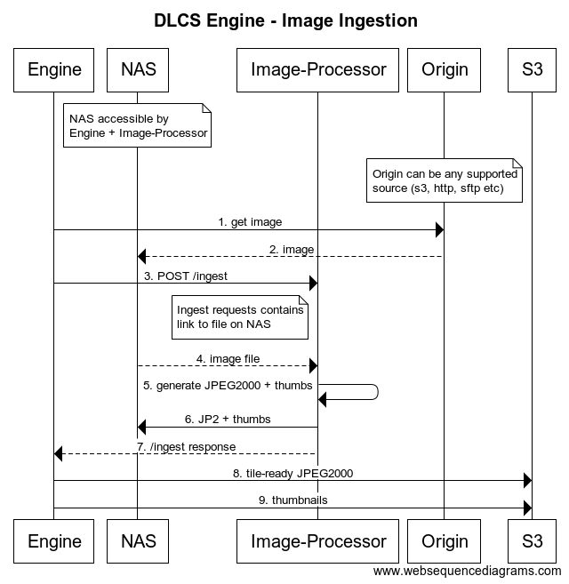
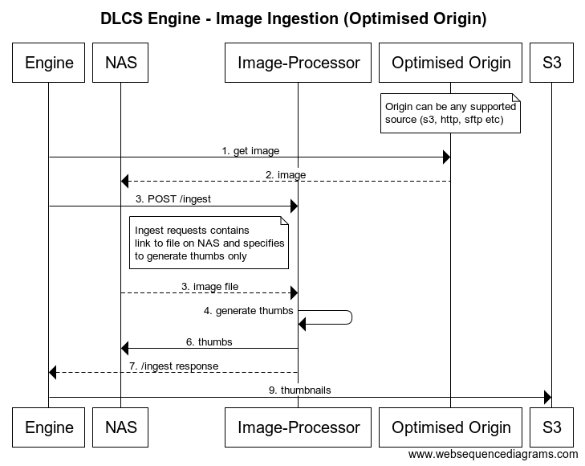

# Engine - Image

## Context

This document addresses ingesting and preparing image assets for delivery (not not the delivery of the image assets - that is a job for [Orchestration](002-storage-and-orchestration.md)).

This involves generating tile-friendly versions (JPEG2000) of any image assets uploaded alongside thumbnails for efficient serving of smaller images. This element of the DLCS is known as the 'Engine', and has slightly different implementations for [AV](007-Engine-AV.md) and images.

## Architecture

Every Engine is deployed alongside an Image-Processor, the Image-Processor being a side-car when deployed in a containerised environment. This relationship allows image processing to be scaled easier as every new engine gives a new Image-Processor. 

To cut down on latency the engine and image-processor share local storage, as this is the fastest way to share image resources.

## Consuming

The engine exposes a single API endpoint for ingesting/reingesting an image. This is not publicly available,  but is exposed within the private network running the wider DLCS. <!--This means other systems in the DLCS can make HTTP requests to the Engine but generallyInteractions are either via a request to in response to an HTTP request to the API, or via a queue (such as SQS on AWS). -->

Direct HTTP interactions happen synchronously and should be rare. The call is processed synchronously and the end-user, be that a human or automated process, may need to wait for a period of time before the request is complete (see below 'Image Ingestion' sequence diagram).

The preferred interaction is by creating a batch of ingest requests. These requests are then put onto a queue and processed asynchronously, with the engine controlling the number of workers that are running at any given time. The workers can be increased on an individual instance of the Engine - or by creating multiple instances of the Engine. The latter can be done in response to, or preparation of, a spike in ingest traffic. For example, 1000's of newly digitised assets needs added to the DLCS.

Both of these requests will generally go via the API, which will verify request is valid, read user authenticatino etc and forward on calls to the Engine, either directly or via a message queue.

### Sample Requests

The most basic request:
```json
{
  "id": "basic-request",
  "space": 1,
  "origin":"https://example.org/interesting-image"
}
```

A request declaring various policies and metadata:
```json
{
  "id": "basic-request",
  "space": 1,
  "origin":"https://example.org/interesting-image",
  "imageOptimisationPolicy": "https://my.dlcs/imageOptimisationPolicies/fastest",
  "thumbnailPolicy": "https://my.dlcs/thumbnailPolicies/museum",
}
```

> Note: Requests to the API may contain other properties but the above are those related to image ingestion.

## Image Ingestion

An image is ingested from an 'origin'. The origin is the somewhere on the web where the image is accessible. This can be from a variety of sources, generally:

* Publicly available at a URI.
* Available at a public URI with authentication (e.g. basic http authentication).
* Public S3 bucket
* Private S3 bucket
* FTP/SFTP

The general process for ingesting images is shown below:



In the above sequence diagram the Engine was triggered by either a direct HTTP request, or by picking up a message from a queue. The method of ingest is not important as ultimately the payload contains the same information "here is an image that I want to be able to consume as a IIIF image service".

The `1. get image` request can contain both an `ImageOptimisationPolicy` and a `ThumbnailPolicy` (or neither, in which case it will fallback to a default value). These are configured in the DLCS database and dictate how an image should be handled by the Image-Processor, and are passed along as part of `3. POST /ingest`.

The method in which the image is fetched can be controlled by the `CustomerOriginStrategy`, see [below](#customer-origin-strategy) for further details.

An `ImageOptimisationPolicy` tells the Image-Processor how to generate the tile-ready JPEG2000 should be generated - the exact details will depend on the Image-Processor implementation but can help define when to use "slower high quality" vs "fast but lossy" vs "slowest max quality".

A `ThumbnailPolicy` is simply a list of thumbnail sizes that need to be generated. An example is `1000,400,200,100`, the size being the size of the longest side. See [Thumbnails](001-thumbnails.md) and [Storage and Orchestration](002-storage-and-orchestration.md) on how these are used to optimise some requests.

### Customer Origin Strategy

There are different methods of fetching images from downstream origins. These are declared as a `CustomerOriginStrategy` and consist of the following properties:

| Property Name | Description                                                                                 | Example                                    |
|---------------|---------------------------------------------------------------------------------------------|--------------------------------------------|
| Customer      | Which customer this strategy is for                                                         | 1                                          |
| Regex         | A regex that is compared against Origin, if match then this strategy is used                | http[s]?:\/\/(.*).example.org              |
| Strategy      | The named strategy that this will use                                                       | basic-http-auth, sftp                      |
| Credentials   | Either a blob of encrypted JSON, or a link to private object storage containing credentials | s3://eu-west-1/dlcs-secrets/cos-creds.json |
| Optimised     | Boolean value signifying if this origin is optimised for delivery (see below)               | true, false                                |

There are currently 4 supported strategies:

* Basic Http Authentication: used when consuming an Origin that requires basic HTTP authentication. Requires `Credentials` to be provided.
* S3: use AWS cli to download image from S3 bucket. Can be used with authentication credentials or ambient AWS credentials.
* SFTP: used to download image via SFTP protocol.
* Default: fallback method, make an HTTP request to download the origin.

#### Optimised Origin

An "optimised" origin is one that is a) fast enough to use as a source for orchestration and b) already contains tile-optimised image files.



This is useful when an institution has already been through a digitisation process and already have a lot of tile-optimised assets that can be copied with little latency (e.g. if DLCS in is AWS this could be an S3 bucket in the same region) and it avoids extra storage costs.

<!--Batch/Synchronous
Priority + normal queue
Initial Origin-->