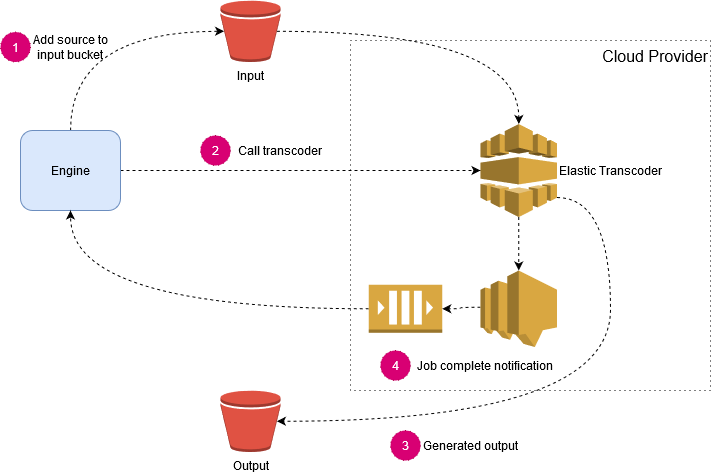

# Enging - AV

## Context

This document addresses ingesting and preparing AV assets for delivery. AV assets are termed as 'time-based media' in the DLCS.

Preparation and ingestion of AV files involves taking what may be a very large original file and converting it into a format, or formats, that are better suited to web delivery. For example the master file may be a 20GB MXF file which is converted to a WEBM and MP4 file for more efficient delivery.

## Architecture

For AV files, the engine is responsible for fetching the source file organises the files during ingestion. The "heavy-lifting" of transcoding the images to various formats is done by an external service; like AWS ElasticTranscoder, AWS MediaConvert or Azure Media Services.

The above diagram demonstrates the interactions between the Engine and a transcoding service, in this example AWS ElasticTranscoder. Due to the potential lengthy processing times, all interactions are asynchronous.

## Consuming

The Engine works by polling messages from 2 different message-queues:

* Ingest - used by for new ingest requests.
* Transcode complete - used by transcoding application to signify that an asset has been transcoded.

The number of 'in-flight' ingestions at any given time can be constrained by configuration and potentially by the size of the files in process. 

For example, an Engine may be able to process 4x1GB video files at any given time but shouldn't accept any more work when processing a single 20GB file.

## AV Ingestion

> Note: This is very similar to [Engine - Image](006-Engine-Image.md) details.

An image is ingested from an 'origin'. The origin is the somewhere on the web where the image is accessible. This can be from a variety of sources, generally:

* Publicly available at a URI.
* Available at a public URI with authentication (e.g. basic http authentication).
* Public S3 bucket
* Private S3 bucket
* FTP/SFTP

### Image Optimisation Policy

The initial ingest request message can contain an `ImageOptimisationPolicy`, if none specified then a default will be used. This is configured in the database and specifies how an image should be transcoded. The exact details are specific to the transcoder implementation but can control variables like formats to produce, bitrates, codecs etc.

The engine is responsible for converting the requested `ImageOptimisationPolicy` (e.g. "video-web") into technical details that the downstream Transcoding service will understand.

The engine then creates a job with the Transcoder service. The engine worker is now free to process another job from the queue.

### Customer Origin Strategy

There are different methods of fetching images from downstream origins. These are declared as a `CustomerOriginStrategy` and consist of the following properties:

| Property Name    | Description                                                                                           | Example                                    |
|------------------|-------------------------------------------------------------------------------------------------------|--------------------------------------------|
| Customer         | Which customer this strategy is for                                                                   | 1                                          |
| Regex            | A regex that is compared against Origin, if match then this strategy is used                          | http[s]?:\/\/(.*).example.org              |
| Strategy         | The named strategy that this will use                                                                 | basic-http-auth, sftp                      |
| Credentials      | Either a blob of encrypted JSON, or a link to private object storage containing credentials           | s3://eu-west-1/dlcs-secrets/cos-creds.json |
| Optimised        | Boolean value signifying if this origin is optimised for delivery (see below)                         | true, false                                |
| FullBucketAccess | Relevant for object stores (e.g. S3). Identifies whether the DLCS can treat object store as it's own. | true, false                                |

There are currently 4 supported strategies:

* Basic Http Authentication: used when consuming an Origin that requires basic HTTP authentication. Requires `Credentials` to be provided.
* S3: use AWS cli to download image from S3 bucket. Can be used with authentication credentials or ambient AWS credentials.
* SFTP: used to download image via SFTP protocol.
* Default: fallback method, make an HTTP request to download the origin.

If `FullBucketAccess` is true and then the source image can be copied directly from Origin to transcoder input bucket. This is an optimisation that removes the need for the Engine to copy the source image from Origin to Disk before copying it to the input bucket.

## Transcode Completion

Once the Transcoder service has completed the job it will place a message on a completed queue. This is monitored by the Engine, on receipt of a message it will ensure that any generated assets are placed in the correct location in the object store. This location will differ for Audio and Video files but will represent the . This will be a resource-oriented, ordered set of parameters expressed as path fragments.

This allows the [Orchestrater](002-storage-and-orchestration.md) to handoff processing of AV to the underlying object-storage if a request for a publicly available AV file comes in.

What are these paths?

## Access Control

