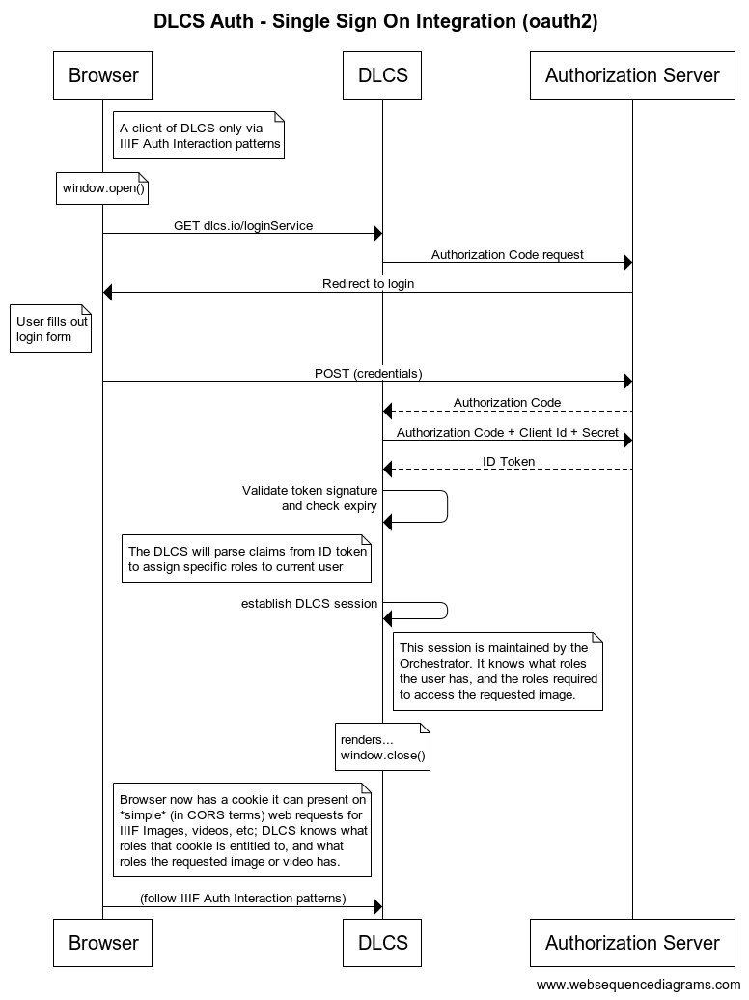

# OpenID Connect / OAuth 2.0

[RFC 005-Access-Control](005-Access-Control.md) outlines how we can use a RoleProvider service to _authenticate_ users and allow the DLCS to _authorize_ their access to image resources.

This document follows on from this to look at how we can use OIDC as an alternative method of role provisioning.

## DLCS as OAuth 2.0 Client

The preference would be for the DLCS to be a direct _Client_ of an OAuth2.0 _Authorization Server_, rather than going via a _role-provider-like_ middleman using the [`Authorization Code Flow`](https://oauth.net/2/grant-types/authorization-code/):



The goal is to get an `id_token` with custom claims that the DLCS can then map to DLCS-specific roles via configuration.

### Configuration

The DLCS `"roleprovider"` database record (not to be confused with RoleProvider application) contains 2 relevant columns:

* `"configuration"` which defines how to log a user in, log them out and get roles etc.
* `"credentials"` which contains any auth credentials required in using above configuration.

#### Role Provider - CAS

An example of the currently supported `"configuration"` block for `"roleprovider"`, to use with a RoleProvider application is:

```json
{
  "default": {
    "config": "cas",
    "target": "http://roleprovider.example.dlcs/login",
    "roles": "http://roleprovider.example.dlcs/roles",
    "logout": "http://roleprovider.example.dlcs/logout"
  }
}
```

Where:
* `<key>` is either `"default"`, or a specific hostname. If the current host matches the hostname then that config block is used, else it falls back to `"default"`.
* `config` - The type of configuration. Currently only `"cas"` is supported.
* `target` - Where the DLCS should redirect user to login. On successful login it sends a token back to DLCS.
* `roles` - URL to POST token to to fetch current user roles (`"credentials"` in the form `{"username": "xxx", "password": "xxx"}` supported to use as basic-auth credentials).
* `logout` - URL to log user out and end their session.

#### Role Provider - OIDC

An alternative configuration block could be (this example uses values from the Wellcome [auth-test](https://github.com/wellcomecollection/iiif-builder/tree/master/src/AuthTest) application):

```json
{
    "default": {
        "config": "oidc",
        "provider": "auth0|azureb2c",
        "domain": "<domain>",
        "scopes": "weco:patron_role",
        "claimType": "https://wellcomecollection.org/patron_role",
        "mapping": {
          "Reader": ["https://api.dlcs.io/customers/2/roles/clickthrough"],
          "Staff": [
            "https://api.dlcs.io/customers/2/roles/clickthrough",
            "https://api.dlcs.io/customers/2/roles/clinicalImages",
            "https://api.dlcs.io/customers/2/roles/restrictedFiles"
          ],
          "Medical": ["https://api.dlcs.io/customers/2/roles/clinicalImages"],
        },
        "unknownValueBehaviour": "Throw|UseClaim|Fallback",
        "fallbackMapping": ["https://api.dlcs.io/customers/2/roles/fallback"]
    }
}
```

Where:
* `<key>` is either `"default"`, or a specific hostname. If the current host matches the hostname then that config block is used, else it falls back to `"default"`.
* `config` - The type of configuration, this introduces `"oidc"` in addition to current `"cas"`.
* `provider` - The identity provider. Ideally behaviour shouldn't change based on provider but it could be handy to know, even if just for logging purposes.
* `domain` - The domain of Authorization Server
* `scopes` - The custom scopes to request (assuming `openid profile` would be requested).
* `claimType` - The claim type that contains field to map
* `mapping` - A collection of `claimValue`:`dlcs-role` mappings (e.g. if user has "Reader" claim they would get clickthrough role only).
* `unknownValueBehaviour` - How to handle an unknown claim value
  * Throw - throw an exception, prevent user logging in
  * UseClaim - use the claim value as-is
  * Fallback - use a default, fallback value as defined in `fallbackMapping`
* `fallbackMapping` - Role(s) to use if `unknownValueBehaviour` is "Fallback". Can be empty if unknown claim doesn't get assigned a role.

Any secrets can be stored in the `roleprovider.credentials` column, e.g. `{"clientId": "xxx", "clientSecret": "yyy"}`

_Note: The above values are based on Auth0 implementation, we may need to store different values for alternative identity providers. For example, rather than `domain` only we may need specific routes (e.g. routes for `login`, `logout`, `token` etc)_

##### RBAC

Rather than using a specific claim and mapping it to a DLCS specific role, and alternative that could be extended in the future is the use of RBAC in the IAM implementation being used and for the DLCS roles to be returned.

The above suggested configuration might still stand without mappings as the roles coming down would be use as-is.

#### Alternative RoleProviders

Extending on the above, possible other RoleProvider configurations could be Clickthrough:

```json
"default": {
  "config": "clickthrough"
}
```

Or an `external` provider from IIIF Auth2, where the IP address of incoming request is the authorizing aspect.

```json
{
    "default": {
        "config": "ip",
        "values": ["10.0.0.16/32"]
}
```

## DLCS Session

Session management in DLCS will continue to work as-is: user is assigned a DLCS cookie and the related roles are stored in DB, this is looked up as and when required etc.

## Useful Links

- OAuth 2.0 Roles - https://auth0.com/docs/authenticate/protocols/oauth#roles
- Authorization Code Flow overview - https://auth0.com/docs/get-started/authentication-and-authorization-flow/authorization-code-flow