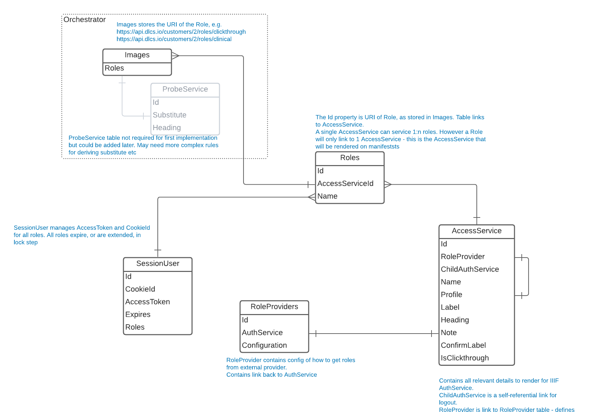
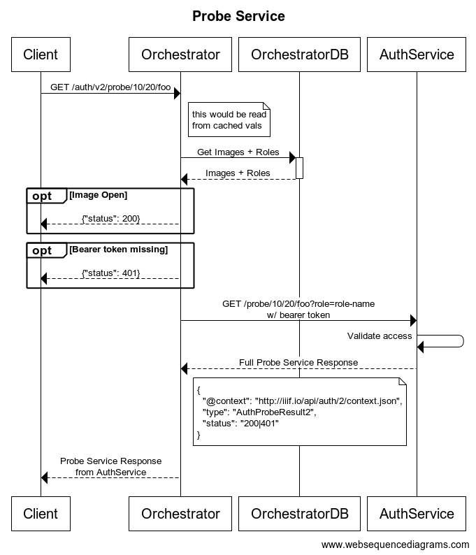

# Separate Auth Service / IIIF Auth 2.0

The DLCS currently supports [IIIF Auth 1.0](https://iiif.io/api/auth/1.0/) and, to a lesser extent, [IIIF Auth 0.9](https://iiif.io/api/auth/0.9/). 

The tables storing related config (Roles, RoleProviders, AuthServices etc) are modelled directly in the main DLCS database. 

## Auth2 Service

This RFC looks at introducing a new, separate auth service for supporting [IIIF Auth 2.0](https://iiif.io/api/auth/2.0/). The main drivers for this are:

* Less risk - it avoids making migrations to the existing DLCS database by introducing a new datastore. Existing role configuration can stay as-is.
* Simplicity - we need to manage a lot more values for IIIF Auth v2 compared to v1.
* Separation of concerns - auth functionality self contained.
* Flexibility - in the future IIIF Auth 3.0 can be introduced as a separate service, rather than requiring changes to Orchestrator.

This will be a self contained service with its own datastore, with the following functionality:

* API supporting CRUD operations on the various auth service properties (for managing presentation strings, configuration on how to obtain role etc). 
  * API will be exposed to callers as if it is part of the wider API, using same keys etc. Users will be unaware they accessing a different service for some API calls.
* Handling all IIIF Auth 2.0 interactions (access service, access token service, logout, probe service)
* User session and auth-token management
* Validating whether a session has access to a role
* Generating auth service IIIF Presentation definitions to add to IIIF manifests.
* Handling OIDC interactions with 3rd customer auth services.

## Interactions

All auth functionality currently resides in the main DB and these tables are used directly by Orchestrator (see [RFC 005-Access-Control](005-Access-Control.md)). 

By moving these to a separate service Orchestrator will need to make external calls to the AuthService in the following circumstances:

* `/info.json` - when generating info.json for a restricted item Orchestrator will need to call the AuthService to get the IIIF auth service description. The `"id"` property returned will be updated dynamically as required (updating `"id"` is already happening for auth 0.9 + 1.0 services).
* IIIF manifest generation (single-item and NamedQuery) - similar to above we will need to call out to get IIIF auth service description for any images that require auth.
* Answering _"Does the current request have access to requested image"_ - part of the asset-delivery pipeline is to verify that an incoming request is able to view the requested image. It does this by interrogating the cookie/bearer token present in the request. This will need to be proxied to the AuthService for auth 2. _This will need to be performant enough to not hinder response times_

> A note on the final bullet, above. The DLCS will need to support 0.9/1.0 and 2.0 at the same time. When making requests for assets a cookie will be provided - the Orchestrator will need to determine which auth service to use. This can be controlled by cookie name, or format of value.

## Database

All AccessService configuration and display values will be stored in the AuthService database.

We will support languages for property values, with multiple strings per language.

Suggested ERD:



## Backwards Compatibility

Orchestrator still handles auth 1.0 + 0.9. As part of the implementation it will return a 401 or 200 from `/info.json` requests depending on whether the user has access to the resource.

For Auth 2.0 we should always return a 200 from `/info.json`, and use the probe service to indicate the status code.

For backwards compatibility we should retain the ability to set 200/401 or always-200 for `/info.json`. This should be configurable per-customer and a simple boolean flag.

## Implementing Auth Spec

This section addresses the various points in the Auth spec and addresses how we will handle these, either in the new AuthService or in Orchestraotr.

The following endpoints will be:

### [Access Service](https://iiif.io/api/auth/2.0/#access-service)

> The access service either grants the authorizing aspect or determines whether the user already has that aspect.

Proposed endpoints:
* AuthService `GET /auth/v2/{customer}/{access-service}?origin={origin}`
  * Where auth-service is the name of the configured access-service in the database.
  * Only `active` profile will be supported initially.

This request will initiate a login request for the specified `{access-service}`. The full flow will be determined by the AccessService config in the database, see [RFC 008 - More Access Control](008-more-access-control-oidc-oauth.md).

The AuthService will render some user interface component for the user to make a gesture on. The contents of this will be driven by values saved in the database. 

The AuthService will render it's own UI for both `clickthrough` and external OAuth provider. The process for each will slightly differ:
* `clickthrough` - the AuthService will render a message in UI, credentials are not required. Once the user has confirmed/agreed to terms we can create a session, set an access cookie and exit.
* OAuth - the DLCS will use [`Authorization Code Flow`](https://oauth.net/2/grant-types/authorization-code/) and follow the sequence diagram in [RFC 008](008-more-access-control-oidc-oauth.md). The returned claims will be parsed to a role and a session created for those roles.
  * If the `?origin=` value is the same as the domain where the DLCS is being hosted we won't need to show a confirmation step. However, if they differ we need to get the user to carry out a significant gesture in the DLCS domain, so we will need to render some UI. The text values for this will be stored in database.

> Note that the auth-service should run on the same domain as orchestrator to avoid any issues cookies.

### [Access Token Service](https://iiif.io/api/auth/2.0/#access-token-service)

> The access token service is used by the client to obtain an access token, which it then sends to a probe service.

Proposed endpoints:
* AuthService `GET /auth/v2/{customer}/token?messageId={messageId}&origin={origin}`

AuthService creates a UserSession and related AccessToken, which is returned to the client as part of HTML payload. Provided `messageId` is echoed back to user.

### [Probe Service](https://iiif.io/api/auth/2.0/#probe-service)

> The probe service is used by the client to understand whether the user has access to the access-controlled resource for which the probe service is declared. The client sends the token obtained from the corresponding access token service to the probe service.

Proposed endpoints:
* Orchestrator `GET /auth/v2/probe/{asset-id}` (e.g. `GET /auth/v2/probe/10/20/foo`)
  * Only the orchestrator knows the relationship between an asset + roles - the AuthService couldn't answer this on it's own.
  * Responses can be shortcut from here - for example if the image doesn't require auth, or an access token hasn't been passed via `Authorization` header.
  * If the asset requires auth, Orchestrator delegates to AuthService to generate the [Probe Service Reponse](https://iiif.io/api/auth/2.0/#probe-service-response) and sends it to client unchanged.
* AuthService `GET /probe/{asset-id}?role={csv-roles}` (e.g. `GET /probe/10/20/foo?role=gold,silver`)
  * The AuthService maintains a list of sessions and can validate that the provided token has access to the requested role. The response can be fully generated as it doesn't have any hostname specific `"id"` values etc.
  * This is on a different path to avoid any DLCS general routing - we may want to add some restrictions to make it only accessible to other DLCS services (via IP or some other auth mechanism).
* Response is still a `AuthProbeResult2` and the HTTP status code will _always_ be 200, even if the client is unauthorised. `"status"` field is used instead.

This is detailed below:



An alternative implementation would be to have the above relationship reversed, with AuthService being the entry point and it calling out to Orchestrator, or API, to get a list of roles for an image. This keeps the Auth responsibilities purely in the AuthService _but_ we lose the ability to shortcut responses as we would always need to get a list of roles. Image:Role could be cached but Orchestrator first keeps this cleaner.

`"substitution"` will not be supported at this point. When introduced in the future the Orchestrator would manage substitutions - which asset is used in place of another asset. These details can be appended to the `AuthProbeResult2` returned from the AuthService.

### [Logout Service](https://iiif.io/api/auth/2.0/#logout-service)

> In the case of the active access service pattern, the client may need to know if and where the user can go to log out.

* AuthService `GET /auth/v2/{customer}/{access-service}/logout`

A 'logout' operation will result in the underyling user session being either deleted, or marked as invalid. If a 3rd party was involved in authenticating the user we won't log them out of that service.

## API

### Management 

The AuthService will have CRUD operations to manage all stored resources. As mentioned above, this will be exposed

### Service Description

The GET operations for AccessService will IIIF services descriptions that can be added to IIIF API Resources. This will be publicly available to render services description elements. The `"id"` value returned will follow default DLCS paths only and would need to be rewritten if alternative paths were used. The endpoint won't verify that an image exists, it will take an image and role and return the service description, e.g.

`GET /auth/v2/service/{asset-id}?role={roles}`, e.g. `GET /auth/v2/service/10/20/foo?role=gold`

```json
{
  "service": [{
    "id": "https://dlcs.example/v2/10/20/foo",
    "type": "AuthProbeService2",
    "service": [{
      "id": "https://dlcs.example/v2/10/gold",
      "type": "AuthAccessService2",
      "profile": "active",
      "label": { "en": ["Login page"] },
      "note": { "en": ["You will be redirected to login"] },
      "service": [{
        "id": "https://dlcs.example/auth/v2/10/token",
        "type": "AuthAccessTokenService2"
      },{
        "id": "https://dlcs.example/v2/10/gold/logout",
        "type": "AuthLogoutService2",
        "label": { "en": [ "Logout of session" ] }
      }]
    }]
  }]
}
```

### Authentication

For the CRUD operations, the new AuthService will need to validate that specified API keys are correct.

For now, while using API-keys, we can delegate auth to DLCS - this is similar to how Composite-Handler will work.
