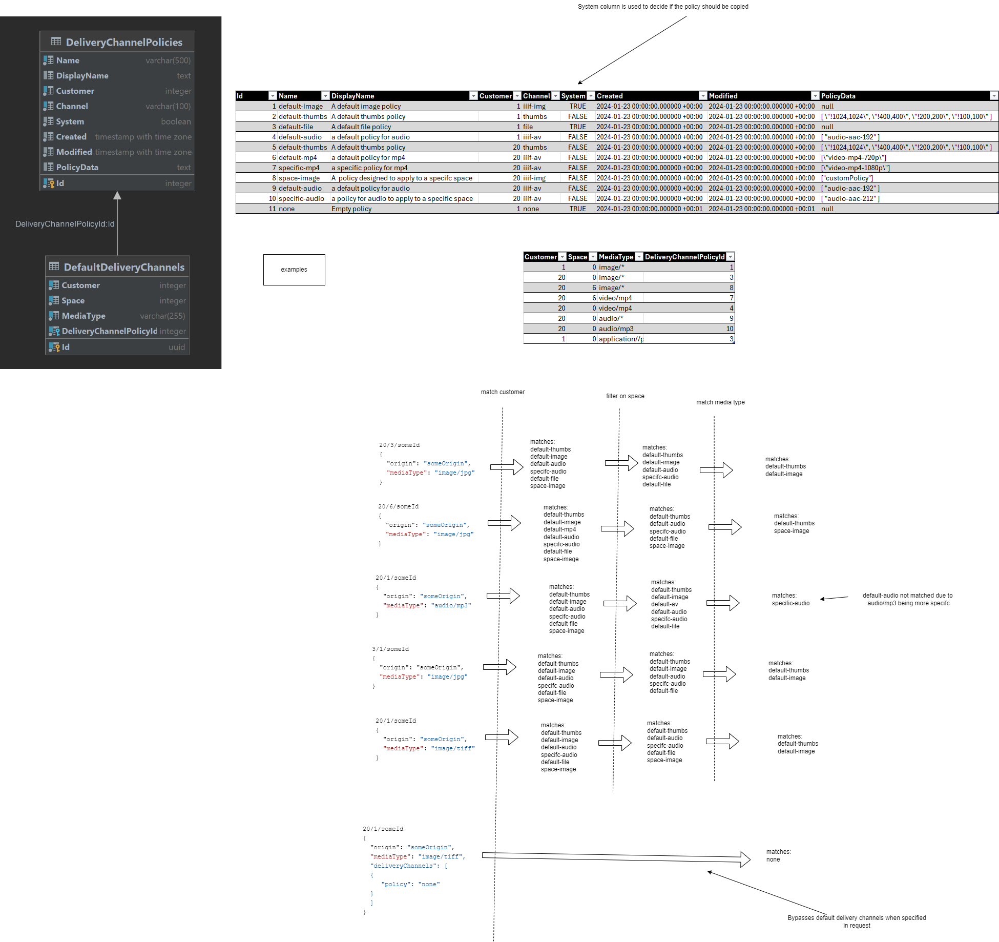
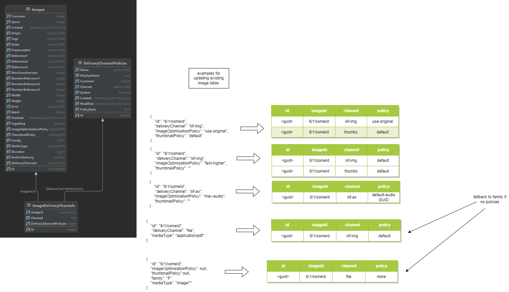

# Delivery channel database design

## Brief

This RFC is related to the [table design for delivery channels](https://github.com/dlcs/protagonist/issues/618) to help show a table design for the additional tables required for the delivery channels work

## Delivery Channel Policy Table




## Delivery channels design on customer creation

We need the initial DeliveryChannelPolicy data:

```
     |--------- (constraint) ------------|
| id | Customer | Channel  | Name          | DisplayName                  | System | PolicyCreated | PolicyModified | PolicyData                                              |
|----|----------|----------|---------------|------------------------------|--------|---------------|----------------|---------------------------------------------------------|
| 1  | 1        | iiif-img | default       | The default image policy     | 1      | 2024-01-01    | 2024-01-01     | null                                                    |
| 2  | 1        | iiif-img | use-original  | Use original at Image Server | 1      | 2024-01-01    | 2024-01-01     | null                                                    |
| 3  | 1        | file     | none          | No transformations           | 1      | 2024-01-01    | 2024-01-01     | null                                                    |
| 4  | 1        | iiif-av  | default-audio | The default policy for audio | 0      | 2024-01-01    | 2024-01-01     | [\"audio-aac-192\"]                                     |
| 5  | 1        | iiif-av  | default-video | The default policy for audio | 0      | 2024-01-01    | 2024-01-01     | [\"audio-aac-192\"]                                     |
| 6  | 1        | thumbs   | default       | An example thumbnail policy  | 0      | 2024-01-01    | 2024-01-01     | [\"!1024,1024\",\"!400,400\",\"!200,200\",\"!100,100\"] |
```

 - DCPs with `system=1` are not copied to customers. They are also referred to in API, both incoming and outgoing, just by their `name`. They do not have `policyData`, the DLCS knows what to do with them.
 - DCPs with `system=0` are duplicated to new customers, thereby acquiring their own URIs and allowing customers to modify them.

If we create Customer 99, three new rows will appear in this table:

```
| 7  | 99       | iiif-av  | default-audio | The default policy for audio | 0      | 2024-01-01    | 2024-01-01     | [\"audio-aac-192\"]                                     |
| 8  | 99       | iiif-av  | default-video | The default policy for audio | 0      | 2024-01-01    | 2024-01-01     | [\"video-mp4-720p\"]                                     |
| 9  | 99       | thumbs   | default       | An example thumbnail policy  | 0      | 2024-01-01    | 2024-01-01     | [\"!1024,1024\",\"!400,400\",\"!200,200\",\"!100,100\"] |
```

We also need a set of template `defaultDeliveryChannels` on Customer 1:

```
| Customer | Space | MediaType       | DeliveryChannelPolicyId |
|----------|-------|-----------------|-------------------------|
| 1        | 0     | "image/*"       | 1                       | 
| 1        | 0     | "image/*"       | 6                       | 
| 1        | 0     | "video/*"       | 5                       | 
| 1        | 0     | "audio/*"       | 4                       | 
| 1        | 0     | "application/*" | 3                       |
```

These are all used to create 5 new rows in defaultDeliveryChannels for a new customer. Those whose DeliveryChannelPolicyId  is for a system=1 DeliveryChannelPolicy reference the original, unique customer 1 row, and those whose DeliveryChannelPolicyId  is for a system=0 DeliveryChannelPolicy reference the customer-specific rows. So if we add a customer 99, we end up with 5 new rows in this table:

```
| 99       | 0     | "image/*"       | 1                       | 
| 99       | 0     | "image/*"       | 9                       | 
| 99       | 0     | "video/*"       | 8                       | 
| 99       | 0     | "audio/*"       | 7                       | 
| 99       | 0     | "application/*" | 3                       |
```

Note that customers don't get given the "use-original" as a default - that can't work as there would then be two possible `iiif-img` channel+policy combinations.

In the above, the initial defaultDeliveryChannels uses two global/system policies and three policies that belong to the user, that they can edit. There are two that match on `image/*` but they are for different channels.

An incoming image/tiff for customer 99 that didn't specify any deliveryChannels would be given:

```
  "deliveryChannels": [
    {
      "@type": "vocab:DeliveryChannel",
      "channel": "iiif-img",
      "policy": "default"
    },
    {
      "@type": "vocab:DeliveryChannel",
      "channel": "thumbs",
      "policy": "https://api.dlcs.io/customers/99/deliveryChannelPolicies/thumbs/standard"
    },
  ]
```

There is also a one off DB-migration task, and that is to apply this new row creation in both tables to all EXISTING customers, so they get the data they would have if created with this mechanism already in place.

These will act as a template and be copied (not referenced) for new customers when a new customer is created.

## Creating new delivery channels

customer creates custom av policy

```
POST /{base}/customers/20/deliveryChannelPolicies/iiif-av
{
   "name": "specific-mp4",
   "displayName": "a specific policy for mp4",
   "channel" : "iiif-av",
   "policyData": "[\"video-mp4-1080p\"]",
}
```
This produces a row in DeliveryChannelPolicies
```
     |--------- (constraint) ------------|
| id | Customer | Channel | Name         | DisplayName               | System | PolicyCreated | PolicyModified | PolicyData            |
|----|----------|---------|--------------|---------------------------|--------|---------------|----------------|-----------------------|
| 1  | 20       | iiif-av | specific-mp4 | a specific policy for mp4 | 0      | (now)         | (now)          | [\"video-mp4-1080p\"] |
```

And there's now a DeliveryChannelPolicy resource at /customers/20/deliveryChannelPolicies/iiif-av/specific-mp4 that would look like this:
```
{
    "@id": "https://api.dlcs.io/customers/20/deliveryChannelPolicies/iiif-av/specific-mp4",
    "@type": "vocab:DeliveryChannelPolicy",
    "name": "specific-mp4",
    "displayName": "a specific policy for mp4",
    "channel": "iiif-av",
    "policyData": "[\"video-mp4-1080p\"]",
    "policyCreated": "2024-01-24T15:36:58.6023600Z",
    "policyModified": "2024-01-24T15:36:58.6023600Z"
}
```

This can be used immediately for when you specify explicit delivery channels on an Asset:

```
{
  "origin": "https://repository.org/films/my-movie.mov",
  "deliveryChannels": [
    {
      "channel": "iiif-av",
      "policy": "https://api.dlcs.io/customers/20/deliveryChannelPolicies/iiif-av/specific-mp4"
    }
  ],
 
}  
```
But we like this policy so we want it to apply automatically on Space 5:

```
POST /{base}/customers/20/spaces/5/defaultDeliveryChannels
{
   "channel" : "iiif-av",
   "policy": "https://api.dlcs.io/customers/20/deliveryChannelPolicies/iiif-av/specific-mp4",
   "mediaType": "video/*"
}
```#
This creates a row in DefaultDeliveryChannels:
```
| Customer | Space | MediaType    | DeliveryChannelPolicyId |
|----------|-------|--------------|-------------------------|
| 20       | 99    | "video/*"    | 1                       | 
```
Now we want that on some more spaces so we POST that same payload...

```
{
   "channel" : "iiif-av",
   "policy": "https://api.dlcs.io/customers/20/deliveryChannelPolicies/iiif-av/specific-mp4",
   "mediaType": "video/*"
}
```

...to:
/customers/20/spaces/99/defaultDeliveryChannels
/customers/20/spaces/334/defaultDeliveryChannels
/customers/20/spaces/1234/defaultDeliveryChannels
Giving us

```
| Customer | Space | MediaType    | DeliveryChannelPolicyId |
|----------|-------|--------------|-------------------------|
| 20       | 5     | "video/*"    | 1                       | 
| 20       | 99    | "video/*"    | 1                       | 
| 20       | 334   | "video/*"    | 1                       | 
| 20       | 1234  | "video/*"    | 1                       | 
```

They we decide we want to re-use this same policy globally, but only for MPEGs:
```
POST /{base}/customers/20/defaultDeliveryChannels
{
   "channel" : "iiif-av",
   "policy": "https://api.dlcs.io/customers/20/deliveryChannelPolicies/iiif-av/specific-mp4",
   "mediaType": "video/mpeg"
}
```
(same payload, different destination)
results in:

```
| Customer | Space | MediaType    | DeliveryChannelPolicyId |
|----------|-------|--------------|-------------------------|
| 20       | 5     | "video/*"    | 1                       | 
| 20       | 99    | "video/*"    | 1                       | 
| 20       | 334   | "video/*"    | 1                       | 
| 20       | 1234  | "video/*"    | 1                       | 
| 20       | 0     | "video/mpeg" | 1                       |
```

## Image delivery channels

