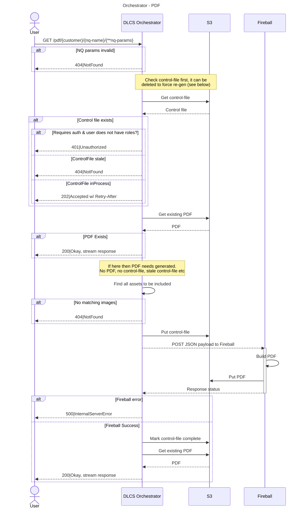
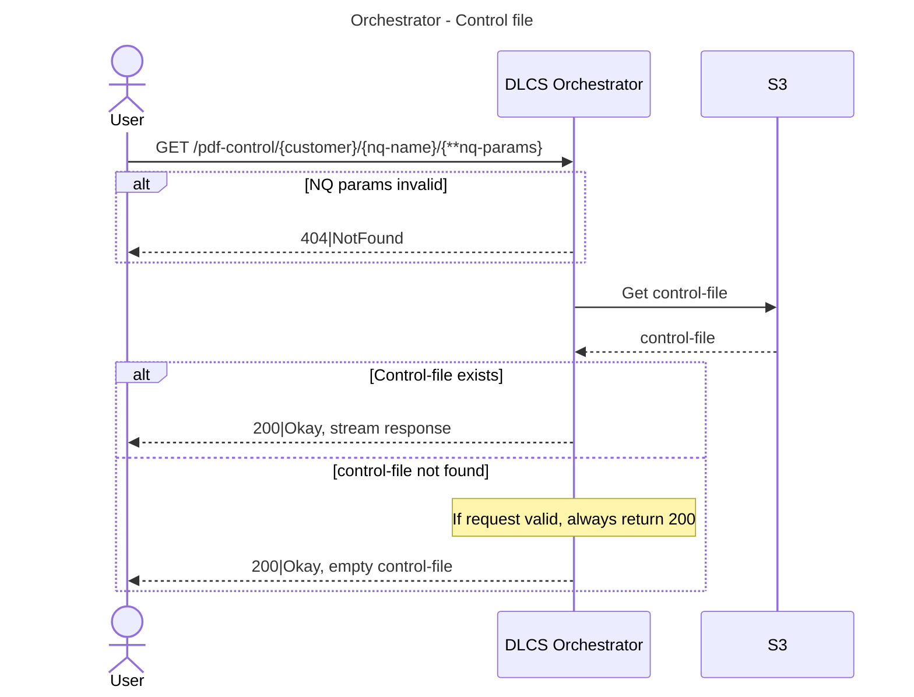
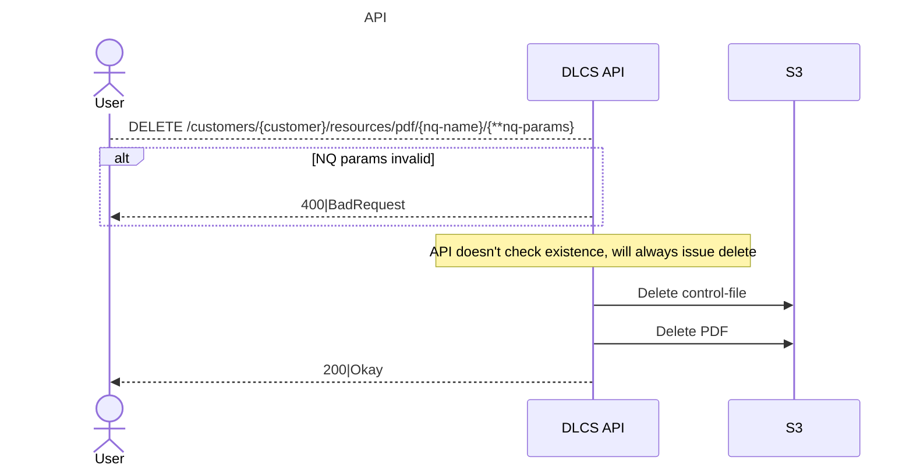
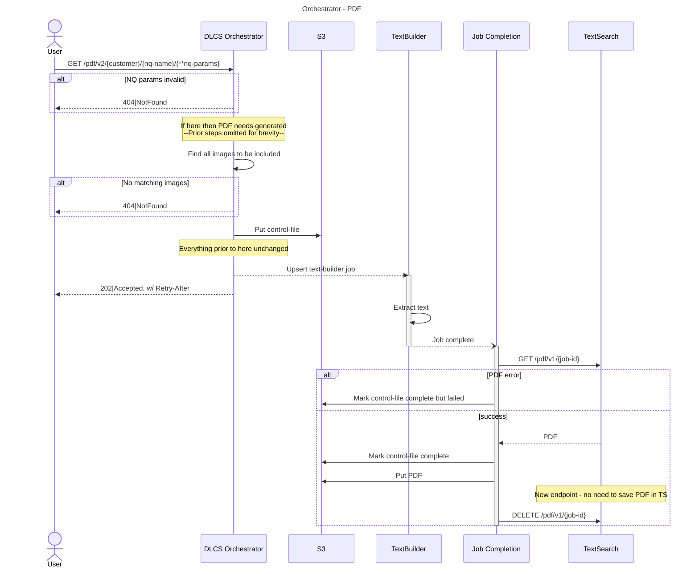

# PDF Generation via Text Services

This RFC looks at how we can leverage the [dlcs/text-services](https://github.com/dlcs/text-services) (TS) service to generate PDFs via Protagonist. This is a new service that acts as a replacement for [dlcs/fireball](https://github.com/dlcs/fireball) and supports additional functionality. In relation to PDFs, the main improvement is generation of a text-layer from any text containing resources.

Some challenges that will be addressed
* API shape - what does the API look like? TS has no auth, all calls must go via Protagonist.
* Generation - currently all NQ generation is synchronous, first request is slow but then cached. TS is asynchronous.
* Serving - how are PDFs saved and served? Are they a property of Protagonist or purely maintained by TS? Do we need to maintain control-files?
* Auth - how are PDFs requests protected?
* Job identification - A single TS instance will be serving multiple purposes for IIIF-CS only, how do we partition ids to avoid collisions?

## Out of Scope

This proposal is to support generating PDFs from DLCS Assets via NamedQueries (NQ). It does not address generating PDFs from arbitrary IIIF Manifests, that functionality is suited to [dlcs/iiif-presentation](https://github.com/dlcs/iiif-presentation).

## Current

For context to rest of document, this is an outline of the current approach. 

Protagonist can, via NQs, project the results of an asset query into a container type. The Orchestrator URL syntax for all projection types is consistent `/{type}/{?version}/{customer}/{nq-name}/{**nq-params}` (e.g. `/iiif-resources/99/example/19th-century/10`). There are currently 4 supported projection types:

1. `raw-resource` - JSON (Asset id only)
2. `iiif-resource` - IIIF Manifests
3. `pdf` - PDF
4. `zip` - Zip archive

The latter 2 have identical processing; they are generated synchronously on demand, the initial request being slower and subsequent requests are served from a non expiring cache. They also use a "control file" to track processing status, prevent multiple generation requests running in parallel, and to store any auth requirements.

### In-Depth

> [!NOTE]
> With the exception of calling `Fireball` the overall processing for any 'persisted projection' is identical.
>
> As detailed above the only currently supported alternative is a zip archive.

Below are sequence diagrams that outline the current operations supported for PDFs. 

#### Orchestrator - PDF generation and serving

The below diagram shows the flow for how PDF projections are generated and served.



#### Orchestrator - fetch control-file

Orchestrator can serve the generated PDF control-file. This can be used to check the status, size etc.



#### API - delete control-file

Protagonist will indefinitely cache generated PDF files and doesn't track when a previously generated NQ would return different results if called again.

If a consumer knows that a PDF is out of date and needs reprocessed invalid they can force this by deleting the control-file and PDF via the API, which requires valid credentials.



## Proposal

Overall we should, as much as possible, stick to the current processing flow: control-files will continue to store the current status and any role requirements, Orchestrator will serve PDFs in order to apply any auth restrictions. The following sections look at any changes to accommodate new requirements.

### PDF Generation

Fireball can create PDFs on demand, this allows Orchestrator to synchronuously generate on the fly, holding up the incoming request. This isn't possible using TS. 

For TS to build a PDF it first needs to build the text artefacts, the PDF can only be generated once this has been done, see [architecture](https://github.com/dlcs/text-services#architecture). The former is an asynchronous operation that accepts a payload in a similar format to Fireball.

We will continue to use the control-file as a means to track what's been created/what should already exist. 

TS will raise a 'job completed' notification that Protagonist can subscribe to. Once that's done we can, out of band, generate and fetch the PDF and upload it to S3 storage, updating the control-file. Subsequent GET requests will be served the generated PDF.



> [!NOTE]
> It's not in the sequence diagram but "Job Completion" will receive completed notification via an event-broker.
>
> Engine is the best fit to handle this logic but it doesn't have any knowledge of NQs or projections, those are currently Orchestrator concerns.

### New URL `/pdf/v2/*`

The new PDF generation reflects a change in behaviour - PDF generation is now asynchronous. As this is a change in behaviour I suggest we use a new PDF version slug in the URL to handle the new format. 

* `/pdf/v1/{customer}/{nq-name}/{**nq-params}` will continue to user Fireball for PDF generation. It follows the "current" sequence diagram. We can control use of this via a feature-flag, if there have never been PDFs for a deployment there's no need to maintain this.
* `/pdf/v2/{customer}/{nq-name}/{**nq-params}` is the new handling, this will return 202|200 etc, following the new sequence diagram behaviour.
* `/pdf/{customer}/{nq-name}/{**nq-params}` will be an alias for either `/v1/` or `/v2/`, depending on configuration. This config doesn't need to be Customer specific, setting it at environmental level is enough.

> [!WARNING]
> If the PDF has already been generated, both `/v1/` and `/v2/` paths could serve a PDF generated via Fireball or TS. The version split relates to the different generation behaviours, rather than any guarantees on what the PDF contains.

### OCR Data

TS has documented rules on [supported text formats](https://github.com/dlcs/text-services#supported-text-formats). Adjuncts associated with Assets that have suitable `iiifLink`, `properties`, `label` etc will automatically be picked up and included in the generated PDF.

### Text Builder Job Identity

Text-builder doesn't apply any restrictions on job identities - it is up to the consuming service to enforce the format. Text service jobs will have the format `{customer}/pdf-nq/{pdf-id}` (e.g. `99/pdf-nq/by-string1_122`) where:
* `{customer}` is the customers numeric identifier to scope any further identifiers to this customer.
* `pdf-nq` is a hardcoded path slug to scope the request to _"PDFs generated from NamedQueries"_. We could use "pdf" alone here but we may want to generate alternative pdfs in the future.
* `{pdf-id}` is a unique identifier for the PDF. This is `{nq-name}_{projection-metadata-id}`, where
  * `{nq-name}` is the name of the NQ
  * `{projection-metadata-id}` is the PK of the projection for this NQ. This is a new table, see [Projection Metadata Table](#projection-metadata-table).
  
See [IIIF-Presentation RFC#job-identity](https://github.com/dlcs/iiif-presentation/blob/develop/docs/rfcs/0007-text-services.md#job-identity) for similar formatting rules.
  
#### Alternative `{pdf-id}`

The above suggests introducing a new table, if we don't want to go down that route there is an alternative. Each projection already has a [`StorageKey`](https://github.com/dlcs/protagonist/blob/ddb2e624da9a74f6610697846e736e8b14884773/src/protagonist/DLCS.Repository/NamedQueries/Parsing/StoredNamedQueryParser.cs#L55) property that ensures uniqueness. This is used as the storage-key where the projection is stored in backing store. 

It contains slashes but these are valid for job identifiers.

### Projection Metadata Table

> [!NOTE]
> This isn't strictly required but would be useful to have.

As noted in [Text Builder Job Identity](#text-builder-job-identity) a new table could be introduced that stores metadata about each projection. This table, `"ProjectionMetadata"`, would store information related to each generated projection - when it was initially generated, when it was last finished etc. This slightly duplicates what is stored in the control-file but I don't think it should replace that file as it's still useful. The control-file could reflect the PK of the corresponding projection metadata row, this could serve as a marker for which PDF version this control-file is for. As a single table it would allow us to track details of all projections, without looking at individual storage keys to interrogate control-files. 

Introducing an accompanying table that storing Assets per projection we could have some powerful metrics that would allow us to:
* Track which Asset is in each projection (_"2/1/secret is now in copyright - we need to delete all projections containing it"_).
* Mark projections as stale, or automatically regenerate them, when an included Asset is updated or deleted.
* Delete projections if all corresponding Assets are deleted.
* Delete projections if NQ deleted.

Suggested minimal schemas for each table:

**Projection Metadata**

| Column     | Type          | Default             | Description                                             |
| ---------- | ------------- | ------------------- | ------------------------------------------------------- |
| id         | UUID          | `gen_random_uuid()` | PK, autogenerated                                       |
| namedquery | text          | -                   | Name of NQ                                              |
| args       | text or jsonb | -                   | NQ arguments. Text if delimited, jsonb if richer object |
| created    | timestamptz   | `CURRENT_TIMESTAMP` | When projection first created                           |
| generated  | timestamptz   | `CURRENT_TIMESTAMP` | When projection last completed                          |
| type       | text          | -                   | Type of projection; PDF, ZIP etc                        |

**Projection Assets**

| Column        | Type | Description               |
| ------------- | ---- | ------------------------- |
| projection_id | UUID | FK. Used in composite-key |
| asset_id      | text | FK. Used in composite-key |

## New Named Query Parameters

Below are 2 possible new NQ parameters. They act like all other NQ parameters, ie they need set in the template and can be hardcoded, reference fields or derived from parameters etc.

See [Appendix 1](#appendix-1---nq-example) for an example of how these could be used.

### Page Selection

> [!NOTE]
> For PR reviewers - do we want to support this, or should this be controlled by better metadata field management?
>
> It seems like a nice to have, rather than a concrete requirement. Results, particularly of ordered or grouped, could be difficult to predict.

Introduce a new `index` NQ parameter. It would take a 0-based index of Canvases to include in projection, e.g. `&index=0-10,24,40-42`

### Group By

> [!NOTE]
> For PR reviewers - do we want to support this, is it over complicating matters? Comprehension could be an issue here - worth it?
>
> This would have a bigger effect than just PDFs, Manifest projections could also include ranges.
>
> If we do support - is `partitionby` or an alternative name more apt?
>
> See worked example - groupby and ordering could get messy.

Introduce a new `groupby` NQ parameter, acting similar SQL `GROUP BY`. This would accept a single field value and result in "groupings" of these items to be included if possible. 

How this is output would be determined by the projection; Manifest would add a `range`, PDFs would add ToC. The actual contents, Canvases and Pages respectively, would be unaffected.

#### Implementation

We would still issue the DB select statement like normal and apply the grouping in code. Unlike a SQL `GROUP BY` this is not a grouping to aggregrate output but instead a partition, we cannot rely on RDBMS semantics to group.

When iterating all returned Assets, we would use the groupings to create an additional "bucket" of assets containing references to assets. These can be applied as ranges/ToC as applied.

## Specific Requirement

Ticket https://github.com/digirati-co-uk/heritage.tudelft.nl/issues/52 outlines some customer requirements for extended PDF handling for DLCS. Each of the desired features are addressed here:

### Custom front page with metadata
Customising PDF front page is already supported via the `coverpage` NQ parameter. This is a dereferenceable URL that provides a PDF coverpage to use at the start of the PDF, the URL can be parameterised using recognised NQ parameters.

Assuming "with metadata" means that the coverpage will have metadata text displayed on it, rather than embedded metadata in the PDF.

### Page selection

> [!NOTE]
> The decision on [Page Selection](#page-selection) will determine the final response here

This would be controlled by the NQ projection results. Every page in each resultset would be contained within the PDF, to reduce the images included consumers would need to alter metadata.

OR 

NQ `pages` parameter would be used to control which pages are included in each. This could lead to excessive PDF generation and corresponding increase in customer storage - particularly if this was controllable via URL.

### Quality selection

I don't think we should attempt to support this without further investigation. We generate PDFs from pre-generated thumbnails, in order to support a 'quality' we'd need to generate images on the fly, or use alternative resolutions.

One possible solution would be to have a configurable `thumbnailSize` to use for NQs.

### Include OCR data if available

As long as there are appropriately configured adjuncts containing OCR data it will be included.

### Include TOC if available from ranges

> [!NOTE]
> The decision on [Group By](#group-by) will determine the final response here

## Appendices

### Appendix 1 - NQ example

Below is an example of a NQ template using the new parameters and how the output could look. I've chosen to use Manifest as the output as it can all be modelled in JSON, whereas PDF can't.

Below is a table of example images and sample NQ handling with and without the suggested `groupby` parameter. Examples below assuem `appendix` as NQ name.

| AssetId | Reference1 | Reference2 | Number1 | Number2 |
| ------- | ---------- | ---------- | ------- | ------- |
| 2/1/aaa | Alpha      | Glasgow    | 0       | 1       |
| 2/1/bbb | Alpha      | Glasgow    | 0       | 2       |
| 2/1/ccc | Alpha      | Glasgow    | 0       | 3       |
| 2/1/ddd | Alpha      | London     | 1       | 1       |
| 2/1/eee | Alpha      | London     | 1       | 2       |
| 2/1/fff | Alpha      | London     | 1       | 3       |

#### As-is

* NQ template: `assetOrder=n1;n2&s1=p1`
* Request URL: `/iiif-resource/v3/2/alpha`
* SQL Query: `select * from images where reference1 = 'alpha' order by number1, number2`

Simplified result being:
```json
{
    "type": "Manifest",
    "id": "https://dlcs.example/iiif-resource/v3/2/alpha",
    "items": [
        { "id": "2/1/aaa", "type": "Canvas" },
        { "id": "2/1/bbb", "type": "Canvas" },
        { "id": "2/1/ccc", "type": "Canvas" },
        { "id": "2/1/ddd", "type": "Canvas" },
        { "id": "2/1/eee", "type": "Canvas" },
        { "id": "2/1/fff", "type": "Canvas" }
    ]
}
```

#### With Index Selection

* NQ template: `assetOrder=n1;n2&s1=p1&index=0-2,5`
* Request URL: `/iiif-resource/v3/2/alpha`
* SQL Query: `select * from images where reference1 = 'alpha' order by number1, number2`
  * We'd still need to select all results, then filter out when processing.
  * One option, if it was a single continuous list would be to use LIMIT/OFFSET. e.g. `index=10-40` => `... order by number1, number2 offset 10 limit 30`

Simplified result being:
```json
{
    "type": "Manifest",
    "id": "https://dlcs.example/iiif-resource/v3/2/alpha",
    "items": [
        { "id": "2/1/aaa", "type": "Canvas" },
        { "id": "2/1/bbb", "type": "Canvas" },
        { "id": "2/1/ccc", "type": "Canvas" },
        { "id": "2/1/fff", "type": "Canvas" }
    ]
}
```

#### With Grouping

* NQ template: `assetOrder=n1;n2&s1=p1&groupby=s2`
* Request URL: `/iiif-resource/v3/2/alpha/`
* SQL Query: `select * from images where reference1 = 'alpha' order by number1, number2`
  * Same query is issued to DB, the grouping takes place when processing. 
  * One possible issue is if the ordering and groupby don't line up - this could lead to confusing results. OR do we enforce that the first ordering = groupby (either by validation or query generation).

Simplified result being:
```json
{
    "type": "Manifest",
    "id": "https://dlcs.example/iiif-resource/v3/2/alpha",
    "items": [
        { "id": "2/1/aaa", "type": "Canvas" },
        { "id": "2/1/bbb", "type": "Canvas" },
        { "id": "2/1/ccc", "type": "Canvas" },
        { "id": "2/1/ddd", "type": "Canvas" },
        { "id": "2/1/eee", "type": "Canvas" },
        { "id": "2/1/fff", "type": "Canvas" }
    ],
    "structures": [
        {
            "id": "r",
            "type": "Range",
            "label": { "en": ["Table of Contents" ]},
            "items": [
                {
                    "id": "r1",
                    "type": "Range",
                    "label": { "en": ["Glasgow" ]},
                    "items": [
                        { "id": "2/1/aaa", "type": "Canvas" },
                        { "id": "2/1/bbb", "type": "Canvas" },
                        { "id": "2/1/ccc", "type": "Canvas" }
                    ]
                },
                {
                    "id": "r2",
                    "type": "Range",
                    "label": { "en": ["London" ]},
                    "items": [
                        { "id": "2/1/ddd", "type": "Canvas" },
                        { "id": "2/1/eee", "type": "Canvas" },
                        { "id": "2/1/fff", "type": "Canvas" }
                    ]
                }
            ]
        }
    ]
}
```

#### With Index and Grouping

* NQ template: `assetOrder=n1;n2&s1=p1&groupby=s2&index=0,3-5`
* Request URL: `/iiif-resource/v3/2/alpha/`
* SQL Query: `select * from images where reference1 = 'alpha' order by number1, number2`
  * Same query is issued to DB, the grouping takes place when processing. 
  * One possible issue is if the ordering and groupby don't line up - this could lead to confusing results. OR do we enforce that the first ordering = groupby (either by validation or query generation).

Simplified result being:
```json
{
    "type": "Manifest",
    "id": "https://dlcs.example/iiif-resource/v3/2/alpha",
    "items": [
        { "id": "2/1/aaa", "type": "Canvas" },
        { "id": "2/1/ddd", "type": "Canvas" },
        { "id": "2/1/eee", "type": "Canvas" },
        { "id": "2/1/fff", "type": "Canvas" }
    ],
    "structures": [
        {
            "id": "r",
            "type": "Range",
            "label": { "en": ["Table of Contents" ]},
            "items": [
                {
                    "id": "r1",
                    "type": "Range",
                    "label": { "en": ["Glasgow" ]},
                    "items": [
                        { "id": "2/1/aaa", "type": "Canvas" },
                    ]
                },
                {
                    "id": "r2",
                    "type": "Range",
                    "label": { "en": ["London" ]},
                    "items": [
                        { "id": "2/1/ddd", "type": "Canvas" },
                        { "id": "2/1/eee", "type": "Canvas" },
                        { "id": "2/1/fff", "type": "Canvas" }
                    ]
                }
            ]
        }
    ]
}
```